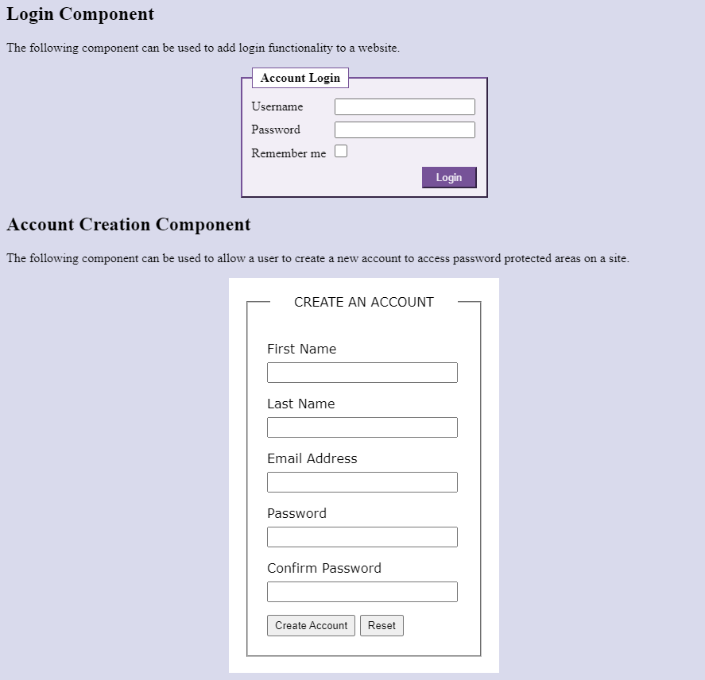

# Create Account Form Activity
In this activity, you will create a form component that is common on many websites. 

## Activity Objectives
1. Create a component to allow a person to create a new account.
2. Style the components with CSS.

> For any forms in this course, you can post the form to the script found at https://secure.riosalado.edu/cis-course-resources/postscript.aspx.

## Account Components Directions
1. Open the `index.html` file created in a previous practice activity.
2. Use the Save As command to save a new file and save it in the same place as the `index.html` file with the name: `accounts.html`.
3. Within the main section:
   1. Remove the definition list.
   2. Create another level 2 heading with the following text: `Account Creation Component`
   3. Add a paragraph with the following text: `The following component can be used to allow a user to create a new account to access password protected areas on a site.`
4. Under the creation heading and after the paragraph:
   1. Insert a form using the postback script listed within the online lesson and the note above.
   2. Apply an `id` to the form of `account-creation`.
   3. Create a fieldset with the following elements:
      1. Create a legend with the following text: `Create an Account`
      2. Create 5 `div` elements with a class of `field-group`.
      3. In each field group, create a label element and an input element based upon the following information:
         1. First name - text input - required
         2. Last name - text input - required
         3. Email address - email input - required
         4. Password - password input - required
         5. Confirm Password - password input - required
      4. Apply the `pattern` attribute to the password and confirm password fields with the following value: `/(?=.*\d)(?=.*[a-z])(?=.*[A-Z]).{6,}/` *This pattern will check that there is at least one number, one lowercase letter, and one uppercase letter.*
      5. Create a submit button with the display text of `Create Account`.
      6. Create a reset button with the display text of `Reset`.
5. Save the file.
6. Apply a commit to the file with the following message: `added account creation form`.

## Styling Directions
> TIP: Unless otherwise specified, most of the selectors you need to create use the descendant selector type to target the specific element, which has a space between the selectors and would follow this pattern: `#id .class element {}` or `#id element {}`.

1. Open the `main.css` file from the `css` folder.
2. Create a selector for the `account-creation` element and apply the following styles:
    1.  Set the width to `300px`.
    2.  Set the margin to `auto`.
    3.  Change the font family to use `Verdana`, `Geneva`, and `sans-serif`.
    4.  Set the background color to be `white`.
    5.  Add a padding of `20px`.
3.  Create a selector for the fieldset element within the `account-creation` element and apply the following styles:
    1.  Add a padding of `24px`. 
4.  Create a selector for the legend element within the `account-creation` element and apply the following styles:
    1.  Add a `text-transform` property with a value of `uppercase`.
    2.  Add a left and right padding of `30px`.
    3.  Align the text to the center.
5.  Create a selector for the `field-group` element within the `account-creation` element and apply the following styles:
    1.  Add a top and bottom margin of `16px`.
6.  Create a selector for the label within the `field-group` element within the `account-creation` element and apply the following styles:
    1.  Change the display to be `block`.
    2.  Set the top and bottom margin to `8px` and the left and right margins to `auto`.  
7.  Create a selector for the input within the `field-group` element within the `account-creation` element and apply the following styles:
    1.  Set the width to be `95%`.
    2.  Change the display to be `block`.
    3.  Set the height to be `20px`.
8.  Create a selector for the button element within the `account-creation` element and apply the following styles:
    1.  Add a top and bottom padding of `4px` and a left and right padding of `8px`.
9.  Save the file.
10. Apply a commit to the file with the following message: `added account create form styles`.

After applying the styles to the forms, it should look similar to the following image:

## Conclusion
1. When you are done with the activity, sync the files (i.e., push your changes) with the remote repo on GitHub.
> TIP: You can view any of your repos by going to the GitHub organization for the course - [RSC-CIS233DA-in-v8](https://github.com/rsc-cis233da-in-v8). You can bookmark the page for future reference.