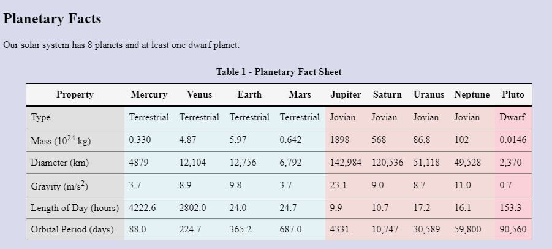

# Advanced Tables Activity
In this activity, you will create a table with some of the more advanced table elements to create column groups, a table header, and a table body. You will then style the table.

## Activity Objectives
1. Create a table.
2. Add additional structural elements to the table.
3. Style the components with CSS.

##  Directions
1. Open the `index.html` file created in a previous practice activity.
2. Use the Save As command to save a new file and save it in the same place as the `index.html` file with the name: `planets.html`.
3. Within the main section:
   1. Delete the definition list.
   2. Add a level 2 heading with the following text: `Planetary Facts`.
   3. Add a paragraph under the heading with the following text: `Our solar system has 8 planets and at least one dwarf planet.`
4. After the paragraph insert a table utilizing the appropriate elements to achieve the following:
   1. Create a caption with the following text: `Table 1 - Planetary Fact Sheet`.
   2. Create 4 column groups where each group spans `1`, `4`, `4`, and `1` columns, respectively.
   3. Apply `id` attributes to the column groups with the following values, respectively: `properties`, `terrestrial`, `jovian`, `dwarf`.
   4. Create a table head and table body.
   5. The table should have 10 columns and 7 rows. 
      1. Use the table below for the data that should be entered into each table cell.
   6. The table head should have 1 row using the `th` element.
   7. The table body should have 6 rows with the first cell in each row using the `th` element and the rest of the cells in the row using `td`.
5. Save the file.
6. Apply a commit to the file with the following message: `added fact table`.

### **Table Data**
Property | Mercury | Venus | Earth | Mars | Jupiter | Saturn | Uranus | Neptune | Pluto
---- | ------ | ------ | ----- | ------ | ------ | ------ | ------ | ------ | ------
Type | Terrestrial | Terrestrial | Terrestrial | Terrestrial | Jovian | Jovian | Jovian | Jovian | Dwarf
Mass (1024 kg) | 0.330 | 4.87 | 5.97 | 0.642 | 1898 | 568 | 86.8 | 102 | 0.0146
Diameter (km) | 4879 | 12,104 | 12,756 | 6,792 | 142,984 | 120,536 | 51,118 | 49,528 | 2,370 
Gravity (m/s2) | 3.7 | 8.9 | 9.8 | 3.7 | 23.1 | 9.0 | 8.7 | 11.0 | 0.7
Length of Day (hours) | 4222.6 | 2802.0 | 24.0 | 24.7 | 9.9 | 10.7 | 17.2 | 16.1 | 153.3
Orbital Period (days) | 88.0 | 224.7 | 365.2 | 687.0 | 4331 | 10,747 | 30,589 | 59,800 | 90,560
> Source: [NASA Planetary Fact Sheet](https://nssdc.gsfc.nasa.gov/planetary/factsheet/)

## Styling Directions
1. Open the `main.css` file from the css folder.
2. Create a selector for the `table` element and apply the following styles:
   1. Use the `border-collapse` property to collapse the borders.
   2. Add a top and bottom margin of `12px` and set the left and right margins to `auto`.
   3. Add a thin solid border to all sides with a black color.
3. Create a selector for the `caption` element and apply the following styles:
   1. Apply a margin to all sides of `10px`.
   2. Apply a bold font weight.
4. Create a selector for the `th` and `td` elements (hint: use a multiple selector which separates the selectors with a comma - `selector, selector {}`) and apply a padding to all sides of `8px`.
5. Create a selector for the `tr` element and apply a thin, solid, gray border.
6. Create a selector for the `thead tr` element and apply the following styles:
   1. Apply a `whitesmoke` background color.
   2. Apply a thin, solid, black border to all sides.
   3. Change the bottom border width to `medium`.
7. Create a selector for the `properties` column group and apply a background color of `hsl(0, 0%, 88%)`.
8. Create a selector for the `terrestrial` column group and apply a background color of `hsl(193, 50%, 93%)`.
9.  Create a selector for the `jovian` column group and apply a background color of `hsl(5, 49%, 90%)`.
10. Create a selector for the `dwarf` column group and apply a background color of `hsl(350, 80%, 90%)`.
11. Save the file.
12. Apply a commit to the file with the following message: `added table styles`.

After applying the styles to the table, it should look similar to the following image:

## Conclusion
1. When you are done with the activity, sync the files (i.e., push your changes) with the remote repo on GitHub.
> TIP: You can view any of your repos by going to the GitHub organization for the course - [RSC-CIS233DA-in-v8](https://github.com/rsc-cis233da-in-v8). You can bookmark the page for future reference. 