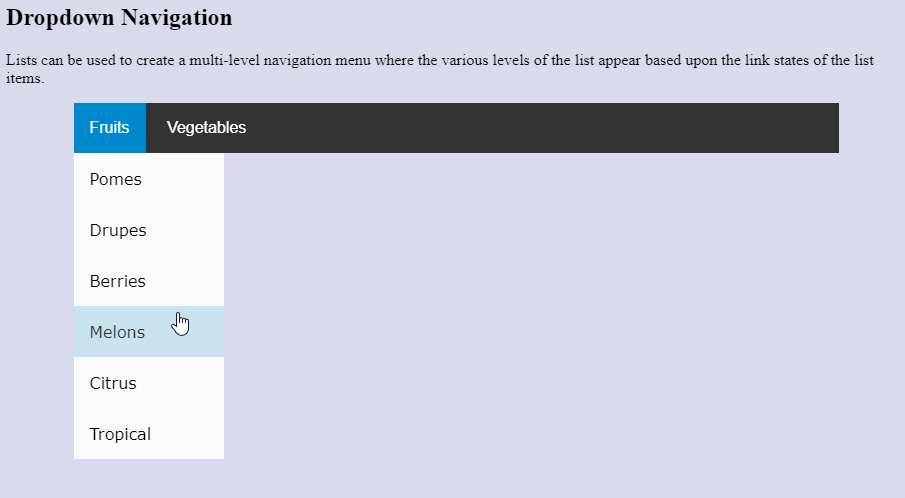

# Dropdown Menu Activity
In this activity, you will use nested lists to create a multi-level drop down navigation menu.

## Activity Objectives
1. Create a navigation menu using nested lists.
2. Style the menu to function appropriately with CSS.

## List-Based Menu Directions
1. Open the `index.html` file created in a previous practice activity.
2. Use the Save As command to save a new file and save it in the same place as the `index.html` file with the name: `dropdown-menu.html`.
3. Within the main section:
   1. Remove the definition list.
   2. Create a level 2 heading with the following text: `Dropdown Navigation`
   3. Create a paragraph with the following text: `Lists can be used to create a multi-level navigation menu where the various levels of the list appear based upon the link states of the list items.`
4. Under the dropdown navigation heading and after the paragraph:
   1. Create a `nav` element with a class of `dropdown-nav`.
   2. Create an unordered list within the nav element.
   3. Create 2 list items with the following:
      1. Apply a class to the list items of `dropdown`.
      2. Create a button with the text `Fruits` for the first list item.
      3. Create a button with the text `Vegetables` for the second list item. 
   4. Under the fruit list item, create a nested unordered list with the following list items: `Pomes`, `Drupes`, `Berries`, `Melons`, `Citrus`, `Tropical`
   5. Under the vegetable list item, create a nested unordered list with the following list items: `Brassica`, `Fruit Vegetables`, `Gourds`, `Greens`, `Fungus`, `Root`, `Pod`
   6. Convert the nested list items text to hyperlinks where the `href` attribute's value is a hashtag `#`. This will make the links work, but not navigate to a different page.
5. Save the file.
6. Apply a commit to the file with the following message: `added nested lists for nav`.

## Styling Directions
1. Open the `main.css` file from the css folder.
2. Create a selector for the `dropdown-nav` element and apply the following styles:
   1. Apply a background color of `hsl(0, 0%, 20%)`.
   2. Set the width to be `85%`.
   3. Set the padding to be `0`.
   4. Set the top margin to be `0`, the left and right margin to `auto`, and the bottom margin to `350px`. *The bottom margin is to create whitespace for the menu to appear within the webpage without overlapping the footer element.*
   5. Set the font family to `Verdana`, `Geneva`, and `sans-serif`.
3. Create a selector for the unordered list within the `dropdown-nav` element and apply the following styles:
   1. Set the list style to `none`.
   2. Set the margins to `0`.
   3. Set the paddings to `0`.
4. Create a selector for the `dropdown` element and apply the following styles:
   1. Set the display to `inline-block`.
5. Create a selector for the button within the `dropdown` element and apply the following styles:
   1. Set the border to `none`.
   2. Set the background color to `inherit` its color from its parent element.
   3. Add a padding of `16px`.
   4. Change the text color to `white`.
   5. Set the font size to be `16px`.
6. Create a selector targeting the button when the `dropdown` element is in a hover state (e.g., `.class:hover element {}`) and apply the following styles:
   1. Change the background color to `hsl(200, 100%, 40%)`.
7. Create a selector for the unordered list within the `dropdown` element and apply the following styles:
   1. Change the display to `none`. *This will hide the nested lists until the user hovers over the navigation list item.*
   2. Change the background color to `hsl(0, 0%, 98%)`.
   3. Set the `min-width` to be `150px`.
8. Create a selector for the unordered list when the `dropdown` element is in a hover state and apply the following styles:
   1. Set the display to `block`.
   2. Set the position to `absolute`.
9. Create a selector for the hyperlink elements within the `dropdown` element and apply the following styles:
   1. Set the paddings to `16px`.
   2. Change the text color to `black`.
   3. Change the display to `block`.
   4. Set the text decoration to `none` to remove the underline.
   5. Change the font size to `16px`.
10. Create a selector for the hover state of the hyperlink elements within the `dropdown` element and apply the following styles:
    1.  Change the background color to `hsl(200, 53%, 86%)`.
11. Save the file.
12. Apply a commit to the file with the following message: `added dropdown menu styles`.

After applying the styles to the menu, it should look similar to the following image:

## Conclusion
1. When you are done with the activity, sync the files (i.e., push your changes) with the remote repo on GitHub.
> TIP: You can view any of your repos by going to the GitHub organization for the course - [RSC-CIS233DA-in-v8](https://github.com/rsc-cis233da-in-v8). You can bookmark the page for future reference. 