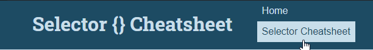
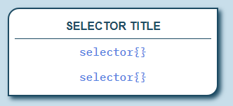

# Lesson 2 Project
This project will assess your knowledge and skills using the various concepts taught within the lesson. 
1. You will need to create 2 HTML pages that utilize the appropriate semantic elements to achieve the desired goal of the steps. 
2. You will need to style the pages following the directions.
3. You will need to validate your code to ensure there are no errors or problems.
4. You will need to apply the accessibility best practices you have learned.

## Project Prep
1. If you haven't done so already, clone the repo to your computer within your course folder.
2. Open the repo within VS Code. You can open this `readme.md` file within VS Code to view the project directions there. 
   > *TIP: Right click on the file and choose the `Open Preview` option.*
3. If there are files and folders present other than this `readme.md` file, take some time to familiarize yourself with the files within the repo so you know where they are located. This will help you when asked to use them within the project directions. *You can ignore the `.gitignore` file.*

> TIP: Before beginning any work on the project, read through all the steps to understand what you will be doing.

## Create Files Directions
Create the following files.

1. Create a new folder called `css`.
2. Create a `main.css` file within the `css` folder.
3. Within the CSS file:
   1. Add a multi-line comment with your name, course, section, and instructor's name.
4. Save and apply a commit to the file.
5. Open the `template.html` file.
6. Add a link to the CSS file you created within the head.
7. Save and apply a commit to the file.

## Reflection Page Directions
Complete the following steps.

1. If necessary, open the `template.html` file.
2. Use the Save As command to save the file with the name `index.html`.
3. Apply a commit to the new file.
4. Add the following metadata to the file:
   1. Page Title
   2. Author - with your name
   3. Description - create an appropriate description based upon the page information
   4. Keywords - create at least 3 page related keywords
   5. Character set as `UTF-8`.
5. Identify the language of the page as *English*.
6. Save the file and apply a commit to your file.
7. Within the document body:
   1. Create a header, main, and footer section.
   2. Within the header:
      1. Create a heading with the following text: `CSS Reflection`
      2. Add a navigation element to the header.
      3. Create two links within the navigation for `Home`, which links to the `index.html` file, and `CSS Cheatsheet`, which links to the `css-cheatsheet.html` file.
   3. Save the file and apply a commit to your file.
   4. Within the main:
      1. Create a heading with the text: `My Reflection`
      2. Create a paragraph and answer the following:
         > *TIP: If you need additional paragraphs or would like to use additional elements, like lists, you may do so.*
         1. Reflect upon what you learned in this lesson and identify at least three things that were new to you and how you think you may use them in a project?
      3. Create another heading with the text: `My Next Steps`
      4. Create a paragraph and answer the following:
         > *TIP: If you need additional paragraphs or would like to use additional elements, like lists, you may do so.* 
         1. Reflecting on what you learned, what element or concept do you feel you need to learn more about or want to explore in more depth? Why do you feel that way? What steps do you feel could help you learn more about it?
   5. Save the file and apply a commit to your file.
   6. Within the footer, add the following information using appropriate elements:
      1. Today's date.
      2. The words `Designed by:` and then your name. 
   7. Save the file and apply a commit to your file.

## Cheatsheet Page Directions
Complete the following steps to create a cheatsheet page that you can review to remind yourself of the various CSS selectors you can use:
1. If necessary, open the `index.html` file.
2. Use the Save As command and save it with the file name `css-cheatsheet.html`.
3. Update the metadata description, title, and keywords to fit the new page.
4. Remove the content from the main section.
5. Update the heading in the header to read: `Selector {} Cheatsheet`
6. In the main section:
   1. Add a level 2 heading with the text: `Selector Types`
   2. Create selector card components for the following:
      1. Element
      2. Class
      3. Id
      4. Universal
      5. Multiple
      6. Pseudo-class
      7. Pseudo-element
      8. Attribute
      9. Combinator
   3. To create the selector card components:
      1. Use a `div` element with a class.
      2. A paragraph for the selector title.
      3. Two code elements for examples of the selector type.
   4. For each of the selector cards:
      1. Add the selector title.
      2. Provide two examples - except for the universal, which only requires one example.
   5. Save and apply a commit to the file.
   6. Add four level 3 headings using the following text:
      1. `Pseudo-Element Selectors`
      2. `Pseudo-Class Selectors`
      3. `Combinator Selectors`
      4. `Attribute Selectors`
   7. Under each heading, create additional selector cards to provide examples of the different types of selectors you learned about for each category:
      1. Pseudo-element should have 8 cards.
      2. Pseudo-class should have 20 cards.
      3. Combinator should have 5 cards.
      4. Attribute should have 7 cards.
7. Save and apply a commit to the file.

## CSS Styling Directions
You will need to create any and all selectors that are needed to target the specific elements on the page. You may utilize tag selectors, classes, ids, pseudo-classes, multiple selectors, descendant selectors, etc. to select the appropriate elements. Keep in mind the cascade, specificity, and inheritance as you apply properties to the various elements.

> Unless otherwise specified, when using units for property values you should utilize relative units when defining dimensions and sizes of elements.

### Create color scheme, reset browser, define fonts

1. Open the `main.css` file.
2. Create a browser reset declaration block to remove the browser's default values for the margin and padding. Also set the box sizing to border box.
3. Create a color scheme for the project.
   1. Use custom properties to define the colors.
   2. One color must use the HSL color method. The other colors can use any other method, including HSL. Remember to select colors that meet the WCAG guidelines.
   3. You should have a minimum of 5 colors: a light color, a dark color, a shadow color that is a semi-transparent version of the dark color, a heading color, and an accent color. You can have more, if desired.
4. Use [Google Fonts](https://fonts.google.com) and select three fonts to import and use. 
   1. Choose a serif, sans-serif, and monospace font.
   2. Add the import code as directed on the Google Font site.
5. Save and apply commits to all files.

### Style the body, headings, and header
1. Style the body as follows:
   1. Apply the light color to the background.
   2. Apply the dark color to the text.
   3. Apply the sans-serif font family with a fallback family.
2. Style all the headings as follows:
   1. Apply the serif font family with a fallback family.
   2. Apply the heading color.
3. Style the header and its elements as follows:
   1. Define the width to be 100 viewport width units.
   2. Define the height to be 80 pixels.
   3. Apply the dark color to the background.
   4. Apply the light color to the text color for the heading and links.
   5. Float the heading and navigation element to the left.
   6. Apply margins to the heading to create space between the left and top sides.
   7. Change the display of the navigation links so they behave like block elements and stack on top of each other.
   8. Remove the text decoration from the navigation links.
   9. Apply a padding around the navigation link to generate whitespace.
   10. Create a hover style for the navigation links that swap the background and text colors.
4. Save and apply a commit to the file. 
   
   

   *Example of what the header should look like, colors and fonts may vary.*

### Style the main section and selector cards  
1. Style the main element as follows:
   1. Add a padding to push content away from the edges.
   2. Apply the `clear` property to the headings set to `both`. *This will remove the floating effect of the elements within the header and anywhere else floats are used*.
2. Style the selector card as follows:
   1. Add a solid border using the dark color.
   2. Apply a radius to the top left and bottom right corners.
   3. Apply a box shadow to the card using the shadow color.
   4. Center align the text.
   5. Apply a white background color.
   6. Float the card to the left.
   7. Add a margin to generate whitespace around the card.
   8. Define the width to be 300 pixels.
   9. Add a padding where the top padding is 2 times as big as the padding on the other 3 sides.
   10. Apply a `text-transform` to the paragraph and set it to `uppercase`.
   11. Apply a bold font weight to the paragraph.
   12. Apply a solid thin bottom border to the paragraph using the dark color.
   13. Apply the monospace font family to the code element with a fallback family.
   14. Apply the accent color to the code element.
   15. Change the display of the code element so they behave like block elements.
   16. Add padding to the paragraph and code elements to create whitespace. 
3. Save and apply a commit to the file.

   

   *Example of what the selector card should look like, colors and fonts may vary.*

### Style the footer
1. Style the footer as follows:
   1. Apply the dark color to the background.
   2. Apply the light color to the text.
   3. Center align the text.
   4. Change the display of the paragraphs to be inline blocks so they appear next to each other.
   5. Add padding to the paragraph to generate whitespace around the elements.
2. Save the file and apply a commit.

## Submit the Project
Before you submit your project:
1. Make sure that you have validated your HTML and CSS code. If any errors were found within the validators, be sure to fix those errors before you submit your assignment.
   > TIP: The validator extensions that you installed during the course introduction will provide details within the Problems tab as you code, which you can open from the `View` menu and then selecting the `Problems` option.
2. Check the colors you selected for accessibility.
3. Save your files and apply any final commits to your work.
4. Push (i.e., sync) the repo on your computer with GitHub to ensure all files are uploaded for your instructor to see.
5. Verify that all files appear on GitHub.
6. Open the Pull Requests tab within GitHub (or using the GitHub Extension within VS Code).
7. In the comment field,
   1. Type in your instructor's username with an @ before. See the course announcements for their username to use.
   2. Tell your instructor that your Project is ready for grading.
8. Click on the `Comment` button to finalize and submit your assignment for grading.
