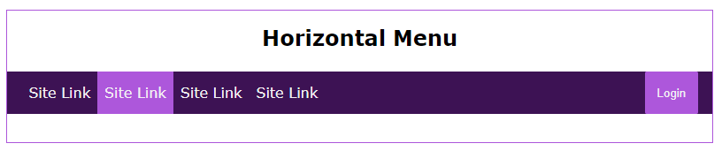

# Navigation Menu Activity
In this activity, you will use flexbox to create a horizontal menu component that can be used to quickly add to projects. You will also replicate the layout using a fallback method.

## Activity Objectives
1. Create a horizontal menu component using floats as a fallback to Flexbox.
2. Style the elements with CSS.

## HTML Directions
1. Open the `index.html` file within the root of the repo.
2. Use the `Save As` command to save a new file.
   1. Save the file to the `flexbox-fallback` folder with the name: `horizontal-menu.html`.
3. Change the page title to the following: `Menu Component`
4. Within the main section:
   1. Remove the `dl` element.
   2. Add a section element with:
      1. A class of `component-wrapper`.
      2. A level 2 heading using the text: `Horizontal Menu`.
      3. A navigation element 
      4. Create 4 placeholder links to each list item (i.e., `<a href="#">Site Link</a>`). *This is good to use during the development phase of projects to put the elements on the page and then update later with the necessary URL and link text.*
      5. Apply a class to one of the links with a value of `active`.
      6. Add a button element with the text `Login`.
5. Save and apply a commit to the file.

## Styling Directions
Use any appropriate selectors and property-value pairs to style the web pages and elements. Keep in mind the cascade, specificity, and inheritance as you apply properties to the various elements.

> Since the site for the practice activity repo is also using a horizontal menu, you can utilize multiple selectors to target both the menu in the component wrapper and the menu within the page header element to style them in the same manner. 

1. Open the `main.css` file from the `css` folder.
2. Style the `component-wrapper` element as follows:
   1. Add a width of `85%`.
   2. Set the left and right margins to `auto` to center the section on the page and `2em` on the top and bottom margins to create whitespace around it.
   3. Add a thin solid border using the accent color.
   4. Add a top padding of `1em` and a bottom padding of `2em`.
   5. Add a bottom padding of `1em` to the heading.
   6. Center align the heading text.
   7. Add a dark background color to the navigation element.
   8. Change the display of the navigation element to `flow-root`. *This will ensure that the navigation element has a height when you float the child elements. Without it, the element would collapse to zero height.*
   9. Add a height of `3em` to the navigation element.
   10. Add a left and right padding of `1em` to the navigation element.
3. Save and apply a commit to the file.
4. Style the menu as follows to **create the fallback layout**:
   1. For the unordered list:
      1. Remove the list style.
      2. Add a height of `100%`.
      3. Float the list to the left. *This is needed to help with placing the login button on the menu bar.*
   2. For the list items:
      1. Float the list items to the left. *This will place the list items horizontally next to each other.*
      2. Add a height of `100%`.
   3. For the links:
      1. Change the display to `block`. *This is needed to allow for the height to fill the menu bar.*
      2. Apply a top and bottom padding of `.85em` and left and right padding of `.5em`.
      3. Add a light text color.
      4. Remove the text decoration.
      5. Add a height of `100%`.
      6. Create a hover link state for the links to swap the background and text colors.
   4. For the button:
      1. Float the element to the right.
      2. Set the height to `100%`.
      3. Apply the accent color to the background.
      4. Apply the light color to the text.
      5. Set the border to `0` to remove it. *Buttons by default have a border applied to them by the browser, so this is needed to remove that default styling.*
      6. Add a left and right padding of `1em` and a top and bottom padding of `0`.
      7. Create a hover state for the button to add a light background color and a dark text color.
   5. Style the `active` link as follows:
      1. Apply the accent color for the background.
      2. Apply a light text color.
5. Save and apply a commit to the file.
6. Style the menu as follows to create the flexbox layout:
   1. Create an `@support()` feature query to check if the browser supports the row flex direction property.
   2. Within the feature query declaration block:
      1. Target the navigation element and:
         1. Change it to a flex container by changing the display to `flex`.
         2. Set the flex direction to `row`.
         3. Justify the content to be `space-between`. *This will place the unordered list along the left edge and the button along the right edge.*
      2. Target the unordered list and:
         1. Change it to a flex container.
         2. Set the flex direction to `row`.
7. Save and apply a commit to the file.

This is an example of what it should look like after you finish styling the elements. It may vary based upon the colors chosen for the color scheme.

## Conclusion
When you are done with the activity:
1. Be sure you check for any validation errors and correct them.
2. Sync the files (i.e., push your changes) with the remote repo on GitHub.