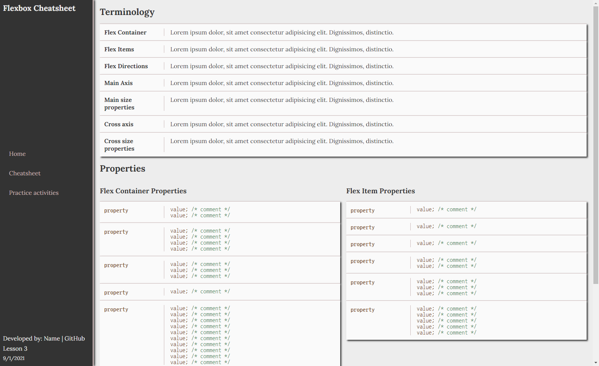

[](https://classroom.github.com/online_ide?assignment_repo_id=7367647&assignment_repo_type=AssignmentRepo)
# Lesson 3 Project
This project will assess your knowledge and skills by creating a cheatsheet page related to the flexbox properties.

## Project Prep
1. If necessary, clone the repo to your computer within your course folder.
2. Open the repo within VS Code. You can open this `readme.md` file within VS Code to view the project directions there.
   > *TIP: Right click on the file and choose the `Open Preview` option.*
3. If there are files and folders present other than this `readme.md` file, take some time to familiarize yourself with the files within the repo so you know where they are located. This will help you when asked to use them within the project directions. *You can ignore the `.gitignore` file.*

## HTML Directions
You will create 2 HTML pages for this project, a reflection page and a cheatsheet page.

### Reflection Page Directions
The reflection page will be the home page for the assignment where you will reflect on what you learned within the lesson, how you can use the concepts in future projects, and what you would like to learn more about. Complete the following steps:

1. Open the `template.html` file within the root of the repo.
2. Use the `Save As` command and create a new file with the name `index.html`.
3. Update the following metadata with appropriate values:
   1. Author
   2. Description
   3. Keywords
4. Within the body:
   1. Create a section element with a class of `left-column`.
   2. Create a main element.
5. Save and apply a commit to the file.
6. Within the section:
   1. Create a level 1 heading with the text `Lesson Reflections`.
   2. Create a navigation element with three links.
      1. Create a link to the home page.
      2. Create a link to the flexbox cheatsheet page.
      3. Create a link to your practice activities repo landing page for this lesson. *TIP: You can navigate to the [GitHub course Organization](https://github.com/rsc-cis233da-in-v8) to find the repo and link to it.*
   3. Create a footer with the following inside of the element:
      1. Add a span element with the text `Developed by:` and then your name and GitHub username.
      2. Add another span element with the text `Lesson 3`.
      3. A small element with the date.
7. Save and apply a commit to the file.
8. Within the main element:
   1.  Add a level 2 heading with the text `My Learning`.
   2.  Create a paragraph and answer the following question:
         > *TIP: If you need additional paragraphs or would like to use additional elements, like lists, you may do so.*
         1. Reflect upon what you learned in this lesson and identify at least three things that were new to you and how you think you may use them in a project?
   3. Create another heading with the text: `My Next Steps`
   4. Create a paragraph and answer the following:
         > *TIP: If you need additional paragraphs or would like to use additional elements, like lists, you may do so.* 
         1. Reflecting on what you learned, what property or concept do you feel you need to learn more about or want to explore in more depth? Why do you feel that way? What steps do you feel could help you learn more about it?
9. Save the file and apply a commit to your file.

### Cheatsheet Page Directions
The cheatsheet page will be a page about the concepts you learned in the lesson. It will provide the important concepts to remember so you can reference it later on to remind yourself of what you learned as you work on projects. Complete the following steps:

1. If necessary, open the `index.html` file.
2. Use the `Save As` command and create a new file with the name `flexbox-cheatsheet.html`.
3. Update the following metadata to match the page's content:
   1. Description
   2. Keywords
4. Update the heading within the section element with the following text `Flexbox Cheatsheet`.
5. In the main section:
   1. Remove the existing content.
   2. Add headings for the following:
      1. Terminology
      2. Properties
6. Save and apply a commit to the file.

### Add the Terms
Under the Terminology heading:
1. Create a definition list.
2. Add the following terms to the list:
   1. `Flex Container`
   2. `Flex Items`
   3. `Flex Directions`
   4. `Main axis`
   5. `Main size properties`
   6. `Cross axis`
   7. `Cross size properties`
3. In your own words, add a description for each of the terms within the definition list.
4. Add a `div` element around each term and its definition with a class of `term-group`. For example:

````html
   <div>
      <dt></dt>
      <dd></dd>
   </div>
````
1. Save and apply a commit to the file.

### Add the Properties
Under the Properties heading:
1. Create a section with an class of `container`.
2. Create two `div` elements within the section.
3. Within the first `div` element.
   1. Create a sub-heading with the text `Flex Container Properties`.
   2. Create a definition list similar to the terminology list:
      1. Add the 7 properties used with the flexbox containers as terms. *TIP: Remember to use an appropriate semantic element when you want to display code to a user.*
      2. Add the associated potential values for each property as a definition and a comment next to the values explaining in your own words what the value does. E.g., `value;  /* aligns to the main start */`
      3. Place the comment text (i.e., from `/*` to `*/`) within a `span` element.
      4. Wrap the term and definitions within a `div` element with a class of `property-group`.
4. Within the second `div` element:
   1. Create a sub-heading with the text `Flex Item Properties`.
   2. Create a definition list similar to the previous lists:
      1. Add the 6 properties used with flexbox items as terms for the list.
      2. Add the associated potential values for each property as a definition and a comment next to the value explaining in layman's terms what the value does.
      3. Wrap the term and definitions within a `div` element like the container list.
5.  Save and apply a commit to the file.

## Styling Directions
Complete the following steps. You will need to create the necessary selectors to target the various elements to style them. You may add any classes and/or ids to the HTML elements to assist in targeting elements. Apply any appropriate property and value to achieve the desired goals of the steps. 

> TIP: Be sure to preview the HTML pages to ensure the stylings are applied correctly.

1. Open the `style.css` file within the `css` folder.
2. Update the comment at the top with the indicated information.
3. Create a color scheme for the site with a minimum of the following (i.e., you can add more if you feel the site design needs it).
   1. A very light color (to be used for the property and term background cards).
   2. A light color (to be used for the body backgrounds and text in the left column section).
   3. A medium color (to be used for the border color and link colors in the left column).
   4. A dark color (to be used for the left column background, shadow colors, and text for the body).
   5. A medium dark color (to be used for the main code color).
   6. Another medium dark color (to be used with the span element in the code).
4. Import at least two fonts to use on the site and create variables that define the font family and fallback fonts.
   1. One font for the main text.
   2. One font for the code elements.
5. Create a browser reset declaration block and remove the default padding and margin, and change the box sizing to the border box.
6. Save and apply a commit to the file.

### Style the body and side section
1. For the body:
   1. Apply the light color to the background.
   2. Apply the dark color to the text.
   3. Convert the element to a flex container.
   4. Define the flow to use the row direction with no wrapping.
   5. Add a flexbox gap of `1em`.
   6. Set the font family using an imported font.
   7. Set the overflow to hidden.
2. For the `left-column` section element:
   1. Make the height the full height of the viewport.
   2. Define the `flex` to have 0 flex shrink, 0 flex grow, and a basis of `250px`.
   3. Apply the dark color to the background and the light color to the text color.
   4. Convert the element to a flex container with a column direction and no wrapping.
   5. Justify the content so there is space between the items.
   6. Add a thick border to the right side using the medium color.
   7. Add a box shadow that falls towards the right using the dark color.
   8. Using relative units, add padding to move the child elements from the element's edges.
3. For the `left-column` heading:
   1. Change the font size for the heading to be 1.3 times the relative size of the text.
4. For the `left-column` navigation element:
   1. Convert the navigation element to a flex container and set the direction so the items stack in a column.
   2. Remove the text decoration from the links.
   3. Color the links to use the medium color.
   4. Add a padding to the links.
   5. Create hover and focus states for the links where the medium color is used for the background and the text color uses the dark color.
5. For the footer element:
   1. Set the height of the footer element to be 5 times the relative size of the text.
   2. Convert the footer element to a flex container, with a column direction, and justify the content so there is space around the items.
6. Save and apply a commit to the file.

### Style the main elements
1. For the main element:
   1. Make the height the full height of the viewport.
   2. Add a width of 100%.
   3. Add a padding to the right side of `1em` to push content away from the edge and make room for the scroll bar.
   4. Set the overflow to `auto` to make the scroll bar reappear when needed if content extends outside of the viewport area.
2. Add top and bottom padding to the headings.
3. For the property group and term group elements:
   1. Convert the elements to a flex container with a row direction, so the term/property is on the left and the definition/values on the right.
   3. Add a thin, solid border to the top using the medium color.
   4. Add a padding to generate white space.
   5. Add the very light color to the background.
   6. Create a box shadow that the shadow falls to the bottom right and used the dark color.
4. For the container:   CONTINUE FROM YESTERDAY!!
   1. Convert it to a flex container using a row direction.
   2. Add a gap of `1em`.
5. Set the direct descendant div elements of the container to have a flex growth factor of 1, a shrink factor of 1, and the basis set to auto. 
6. Style the definition term element's properties as follows:
   1. Apply a thin solid right border using the medium color to create a visual bar between the term and definition.
   2. Set the flex growth factor and flex shrink factor to 0 to it doesn't resize, and the basis to 10 times the relative text size.
   3. Increase the font weight.
   4. Add a right padding of `5px`.
6. Style the definition data element's properties as follows:
   1. Convert it to a flex container with a column direction.
   2. Add a left padding to move it away from the vertical bar.
7. Style the code elements with the appropriate font family variable and first medium dark color for the text color.
8. Style the span element within the code element and apply the second medium dark color for the text color to make them standout.
9. Save and apply a commit to the file.

The following is a screenshot to help you know what it should look like, barring differences in the fonts, colors, etc. that you have selected.



## Submit the Project
Before you submit your project:
1. Make sure that you have validated your HTML and CSS code. If any errors were found within the validators, be sure to fix those errors before you submit your assignment.
2. Apply any final commits to your work.
3. Push (i.e., sync) the repo on your computer with GitHub to ensure all files are uploaded for your instructor to see.
4. Verify that all files appear on GitHub.
5. Open the Pull Requests tab within GitHub (or using the GitHub Extension within VS Code).
6. In the comment field,
   1. Type in your instructor's username with an @ before. See the course announcements for their username to use.
   2. Tell your instructor that your Project is ready for grading.
7. Click on the `Comment` button to finalize and submit your assignment.
