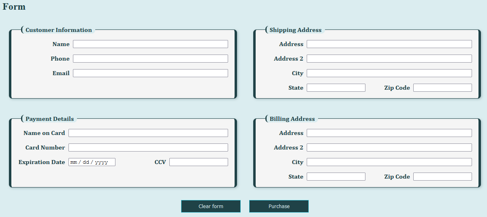

# Form Layout Activity
In this activity, you will review the code within the HTML and CSS files to help troubleshoot some issues with accessibility and then make corrections to improve it.

## Activity Objectives
1. Review and analyze HTML and CSS code.
2. Test the site for accessibility issues using a keyboard.
3. Correct styling issues to address accessibility issues.

## Review the Code Directions
1. Open the `form-layout.html` and `form.css` files within the *grid-accessibility* folder of the repo.
2. Review the form code in the HTML file and the CSS styles in the CSS file so you are familiar with them. Pay attention to the classes, ids, and elements used.

## Test the site Directions
1. Open the HTML page within a browser.
   1. If you installed the Extension Pack in the course introduction lesson, you should be able to right click on the file and select the *vscode-preview-server: Launch on Browser* or *Preview in side panel* option.
   2. If you don't have the extension pack installed, you can navigate to the repo folder on your computer and then open the HTML file directly in a browser to get the same effect.
2. Review how the fields are placed on the page.
   1. Do you notice any issues?
3. Now use the `TAB` key on the keyboard to navigate the web page. Jump between each interactive element. 
   1. What is the order that a user takes through the form fields?
   2. How can this be a problem?
   3. What would be a better solution?

> A major problem you should notice is that as you `TAB` between the input fields, they do not follow a consistent order. It jumps from one column to the next and then back. This needs to be fixed.

## Modify the Code Directions
Now you will go through and modify the code to improve the accessibility of the form and ensure a user can tab between the different form fields correctly.

> NOTE: The solution presented in this activity is only one of several different options that can be done. You may have thought of a completely different option and you are encouraged to also give that option a try to practice implementing different solutions for the same problem. 

### HTML Changes
Within the `form-layout.html` file:
1. Create a new fieldset element in between the two existing fieldsets to create a total of 3 fieldsets for the form.
   1. Add an `id` of `shipping-address`.
   2. Add a legend with the text: `Shipping Address`
   3. Move the following labels and inputs from the Shipping Details fieldset into this fieldset: `street address`, `address 2`, `city`, `state`, and `zip code`.
2. Change the legend of first fieldset from `Shipping Details` to `Customer Information`.
   1. The form labels and fields in the fieldset should be: `name`, `phone number`, and `email address`.
   2. Add an `id` to the first fieldset of `customer-info`.
3. Add an `id` to the last fieldset of `payment-detail`.
4. Add a `split` class to the label and input fields for the zip code, state, card expiration date, and ccv fields.
5. Save and apply a commit to the file.
6. Copy the shipping address fieldset and child elements and paste it after the `payment-detail` fieldset, so you now have a total of 4 fieldsets.
   1. Change the legend to read `Billing Address`.
   2. Change the `id` to `billing-address`.
   3. Change the `for` attributes for the labels and the `id`s for the inputs to include `billing-` in front of it to make them unique. e.g., `billing-address1`.
7. Remove the `group-right` class from all elements.
8. Save and apply a commit to the file.

### CSS Changes
Within the `form.css` file:
1. Create a selector to target the form element.
   1. Convert the element to a grid container.
   2. Create 4 column templates with the first and last columns being `1fr` wide and repeat the middle 2 columns with a width of `10rem`.
   3. Add a grid gap of `.5rem`.
2. Change the following properties for the fieldset element:
   1. Change the template columns to have non-repeating widths of `1fr 3fr`.
   2. Change the grid gap to be `1rem` for the horizontal grid lines and `.5rem` for the vertical grid lines.
   3. Set the `grid-column` to `span 2` columns. 
3. Style the `shipping-address`, `billing-address`, and `payment-detail` elements as follows:
   1. Convert them to grid containers.
   2. Define the template columns to repeat `4` columns that are all `1fr` wide.
4. Save and apply a commit to the file.
5. Style the input fields within the shipping-address, billing-address, and payment-detail fieldsets as follows:
   1. Set the `grid-column` to `span 3` columns.
6. Style the `split` class fields within the shipping-address, billing-address, and payment-detail fieldsets as follows:
   1. Set the `grid-column` to `span 1` columns.
7. Style the input fields within the shipping-address, billing-address, and payment-detail fieldsets as follows:
   1. Set the `grid-column` to `span 3` columns.
8. Change the reset and submit button properties to start in grid row 3 instead of 2.
9. Save and apply a commit to the file.

The following is an example of what the form should look like after you have re-worked the code and styles - barring differences in your color, fonts, etc.

## Conclusion
When you are done with the activity:
1. Be sure you check for any validation errors and spelling errors and correct them.
2. Retest the form to ensure that the progress and order make sense when you `TAB` between them.
3. Sync the files (i.e., push your changes) with the remote repo on GitHub.