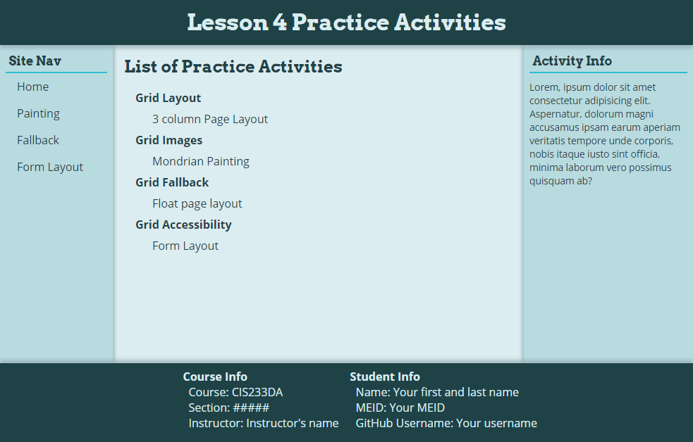

# Grid Fallback Activity
In this activity, you will create a fallback layout method for CSS Grid to layout the content of the page if Grid is not supported within the browser.

## Activity Objectives
1. Define the page layout using floats.
2. Create a feature query to and move the grid layout properties within the query.
3. Style the elements with CSS.

## Styling Directions
Use any appropriate selectors and property-value pairs to style the web pages and elements. Keep in mind the cascade, specificity, and inheritance as you apply properties to the various elements.

1. Open the `main.css` file from the `css` folder.
2. Comment out the current declaration blocks that style the `body`, `header`, `.column.left`, `main`, `.column.right`, `.student-card`, and `footer`. *This should remove the layout and the content of the page should just display normally on the page. This way you can load the page as you work and see how your styles are creating the desired effect.*
3. Save and apply a commit to the file.
4. After the universal selector declaration block, add a comment that says `float layout styles`.
5. Add two additional empty lins and then add another comment that says `float layout styles end`. *You will place all the content for this activity in between these two comments.*

### Create the Float Layout
In between the two comments you created in the steps above:
1. Create a selector to target the `body` element.
2. Move the following properties from the existing `body` element declaration block used for the grid layout to the newly created declaration block (leaving only those properties that are related to Grid):
   1. The `height` property.
   2. The `font-family` property.
   3. The `background-color` property.
   4. The `color` property.
3. Create a selector to target the `header` element and style it as follows:
   1. Add a width of `100vw`.
   2. Add a height of `4em`.
   3. Add a `position` value of `relative`. *This is needed to make the `z-index` property work.*
4. Move the following properties from the existing `header` element declaration block used for the grid layout to the newly created declaration block:
   1. The `text-align` property.
   2. The `background-color` property.
   3. The `color` property.
   4. The `box-shadow` property.
   5. The `padding-top` property.
   6. The `z-index` property.
5. Save and apply a commit to the file.
6. Create a selector to target the `.column.left` element and style it as follows:
   1. Float the element to the left.
   2. Add a width of `10em`. *This matches the first column width in the Grid.*
   3. Add a height and use the `calc()` function to subtract `11em` from `100vh`. *This will take the full height of the viewport and subtract the height of the header and footer to determine what remains.*
7. Move the following properties from the existing `.column.left` element declaration block used for the grid layout to the newly created declaration block:
   1. The `box-shadow` property.
8. Create a selector to target the `main` element and style it as follows:
   1. Float the element to the left.
   2. Add a width and use the `calc()` function to subtract `25em` from `100vw`. *This will take the full width of the viewport and subtract the widths of the two aside column elements to determine what remains.*
9.  Move the following properties from the existing `main` element declaration block used for the grid layout to the newly created declaration block:
   3. The `padding` property.
10. Create a selector to target the `.column.right` element and style it as follows:
    1. Float the element to the left.
    2. Add a width of `15em`. *This matches the last column width within the Grid.*
    3. Add a height and use the calc() function to subtract `11em` from `100vw`.
11. Move the following properties from the existing `.column.right` element declaration block used for the grid layout to the newly created declaration block:
    1. The `box-shadow` property.
12. Save and apply a commit to the file.
13. Create a selector to target the `footer` element and style it as follows:
    1. Add the `clear` property with a value of `both` to remove any text wrapping of previous elements on the page.
    2. Add a width of `100vw`.
    3. Add a height of `7em`.
    4. Add a `position` value of `relative`. *This is needed to make the box shadow display on top of the other elements.*
14. Move the following properties from the existing `footer` element declaration block used for the grid layout to the newly created declaration block:
    1. The `background-color` property.
    2. The `color` property.
    3. The `box-shadow` property.
15. Add a left float to the `student-card` styles.
16. Create a selector to target the first `student-card` element and style as follows: *TIP: Use a pseudo-class selector.*
    1. Add a left margin using the `calc()` function to subtract `15em` from `50%`. *This will move the element to the center of the page and then bring it back towards the left side of the viewport by 15em, which will help center the elements on the page.*
17. Move the following properties from the existing `footer` element declaration block used for the grid layout to the newly created declaration block:
    1. The `background-color` property.
    2. The `color` property.
    3. The `box-shadow` property.
18. Save and apply a commit to the file.

Once done, your page should look like the following - baring differences in color, font, etc.

### Add the feature query
In this section you will take the declaration blocks that layout the page using grid and place them in a feature query.
1. Create a feature query that checks to see if the browser supports grid template columns with a width of `1fr`.
2. Move the selectors and properties *related to the Grid layout* for the following elements to be within the feature query block: `body`, `header`, `.column.left`, `main`, `.column.right`, `.student-card:first-of-type`, `.student-card:last-of-type`, and `footer`. 
3. Save and apply a commit to the file.

## Conclusion
When you are done with the activity:
1. Be sure you check for any validation and spelling errors and correct them.
2. Sync the files (i.e., push your changes) with the remote repo on GitHub.