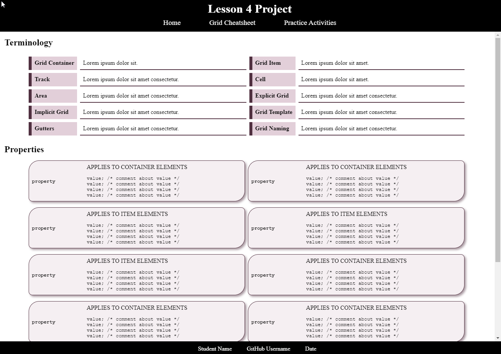

# Lesson 4 Project
This project will assess your knowledge and skills by creating a cheatsheet page related to the grid properties.

## Project Prep
1. If necessary, clone the repo to your computer within your course folder.
2. Open the repo within VS Code. You can open this `readme.md` file within VS Code to view the project directions there.
   > *TIP: Right click on the file and choose the `Open Preview` option.*
3. If there are files and folders present other than this `readme.md` file, take some time to familiarize yourself with the files within the repo so you know where they are located. This will help you when asked to use them within the project directions. *You can ignore the `.gitignore` file.*

## HTML Directions
You will create 2 HTML pages for this project, a reflection page and a cheatsheet page. If no element is specified, you must decide the most appropriate element to use. 

### Reflection Page Directions
The reflection page will be the home page for the assignment where you will reflect on what you learned within the lesson, how you can use the concepts in future projects, and what you would like to learn more about. Complete the following steps:

1. Create an HTML document and call it `index.html`.
2. Add all the necessary base elements to structure the document.
3. Add the following metadata:
   1. Page title
   2. Author
   3. Description
   4. Keywords
   5. Character Set
   6. Document language
4. Using appropriate elements, create the following in the body of the page:
   1. Header with a heading using the text `Lesson 4 Project`.
   2. Navigation with 3 links to the home page, cheatsheet page, and the home page of your practice activities.
   3. Main
   4. Footer with your name, GitHub username, and date.
5. Save and apply a commit to the file.
6. In the main element:
   1. Create two headings with the text `My Reflections` and `My Next Steps`.
   2. Using appropriate elements, answer the following under the reflections heading:
      1. Reflect upon what you learned in this lesson and identify at least three things that were new to you and how you think you may use them in a project?
   3. Using appropriate elements, answer the following under the next steps heading:
      1. Reflecting on what you learned, what property or concept do you feel you need to learn more about or want to explore in more depth? Why do you feel that way? What steps do you feel could help you learn more about it?
7. Save and apply a commit to the file.

### Grid Cheatsheet Page Directions
The cheatsheet page will be a page about the concepts you learned in the lesson. It will provide the important concepts to remember so you can reference it later on to remind yourself of what you learned as you work on projects. Use the online reading and the Grid standard module. Complete the following steps:

1. Using the `index.html` file, save a new file with the name `grid-cheatsheet.html`.
2. Update the metadata to reflect the content of the page.
3. Remove the content within the main element.
4. Create two headings with the text `Terminology` and `Properties`, respectively.
5. Under each heading:
   1. Create a definition list with a class for each.
   2. For the terminology list, add the following terms and then provide, in your own words, what the term means.
      1. `Grid Container`
      2. `Grid Item`
      3. `Track`
      4. `Cell`
      5. `Area`
      6. `Explicit Grid`
      7. `Implicit Grid`
      8. `Grid Template`
      9. `Gutters`
      10. `Grid Naming`
   3. Save and apply a commit to the file.
   4. For the properties list, add the 25 properties that are used with the Grid layout method as term elements. For each property, add 2 definition elements and add the following to the respective definition:
      1. Identify if it applies to the grid container or grid item element.
      2. List the potential property values with a comment next to the value to explain what the value does. e.g., `<line-number>; /* the line number where the element will begin */` (Hint: Remember since you are displaying CSS code, you should use the appropriate element.)
   5. Wrap each term and definition element(s) within a `div` element.
6. Save and apply a commit to the file.

## Styling Directions
You will utilize the concepts you learned in the lesson (and previous lessons) to layout and style the content on a page. Complete the following:

1. Create a subfolder with the name `css`. 
2. Create a new file in the subfolder with the name `style.css` and open the file.
3. Add a comment at the top with your name, course and section, and instructor's name.
4. Create a color scheme to use for the project based upon the following:
   1. Three background colors - a main color, a secondary color, and tertiary color.
   2. Three text colors to go with the background colors.
5. Import fonts to use for the project based upon the following:
   1. A main san-serif font.
   2. A heading sans-serif font.
   3. A code monospace font.
   4. Include fallback fonts for each beyond the generic font families.
6. Save and apply a commit to the file.

### Page Layout
If needed, you may apply any necessary `class` or `id` attributes to the HTML elements to use for selectors and target the elements.

1. Define the body to be a grid container.
   1. Layout the pages using an explicit CSS Grid with 1 column and 4 rows.
   2. Define the row templates to use flexible units for rows 1, 2, and 4 so that the 1st row is 3 units and rows 2 and 4 are 2.5 units in relation to the font size (HINT: `em` units).
   3. Allow the third row to `auto` size with the remaining space.
   4. Set the overflow property on the body to `hidden` and on the main element as `auto`.
2. Define the header, navigation, main, and footer to be in rows 1 through 4, respectively.
3. Apply a dark background color to the header, navigation, and footer.
4. Apply a light text color to the header, navigation links, and footer.
5. Flex the navigation so the links appear in a horizontal line in the center with space in between the items.
6. Increase the font size of the navigation links.
7. Flex the footer so your name, Github username, and date appear in a horizontal line in the center with space in between the items.
CONTINUE!
8. Apply the selected font families to the headings and body text.
9. Create appropriate link states for the navigation links.
10. Use a calculation notation to determine the height of the main element subtracting the heights of rows 1, 2 and 4 from the full viewport height.
11. Save and apply a commit to the file.

### Cheatsheet Styling
If needed, you may apply any necessary `class` or `id` attributes to the HTML elements to use for selectors and target the elements.

1. Style the code elements with the selected font family and color.
2. Style the terminology list to achieve the following:
   1. A width of 90% and centered on the page.
   2. Convert the list to a grid container where:
      1. There are 5 rows and 4 columns.
      2. Place the terms in the 1st and 3rd column and the definitions within the 2nd and 4th column.
      3. Add a gap between the rows and columns.
      4. Change the color of the term.
      5. Apply a thick solid border to the left side of the term.
      6. Add a background color to the term.
      7. Apply a bottom border to the definition.
3. Save and apply a commit to the file.
CONTINUE
4. Style the properties list to achieve the following:
   1. A width of 90% and centered on the page.
   2. Convert the list to a grid container where:
      1. The column templates are repeated creating 2 columns with a width of 1 fraction unit.
      2. The row templates that are created automatically.
      3. A gap between the columns and rows.
   3. The property `div` elements are styled as follows:
      1. Convert the element to a grid container with 2 columns and 2 rows.
      2. Have named areas for the property that spans the first column and two rows, the first definition in the second column and first row, and the second definition in the second column and second row.
      3. The first row template should be 1.5 em units and the second row template allowed to auto size based upon the content.
      4. The first column template should be one fraction of the width and the second column template should be three fractions of the width.
      5. Add a gap between the rows and columns.
      6. Add a border, box shadow, and round corners.
      7. Add padding to push the elements away from the border.
      8. Add a light background color.
   4. Assign to the appropriate named areas the property term element, the first definition element, and the second definition element.
   5. Increase the font weight of the property term.
   6. Self Align the property term to the center of the grid area.
   7. Flex the second definition term so the potential values appear in a vertical stack.
5. Save and apply a commit to the file.

This is an example of what the page should look like, barring any differences with the content you write, colors, fonts, radius values, etc. that you may have selected.

## Submit the Project
Before you submit your project:
1. Make sure that you have validated your HTML and CSS code. If any errors were found within the validators, be sure to fix those errors before you submit your assignment.
2. Make sure you applied accessibility best practices to your project.
3. Apply any final commits to your work.
4. Push (i.e., sync) the repo on your computer with GitHub to ensure all files are uploaded for your instructor to see.
5. Verify that all files appear on GitHub.
6. Open the Pull Requests tab within GitHub (or using the GitHub Extension within VS Code).
7. In the comment field,
   1. Type in your instructor's username with an @ before. See the course announcements for their username to use.
   2. Tell your instructor that your Project is ready for grading.
8. Click on the `Comment` button to finalize and submit your assignment.
