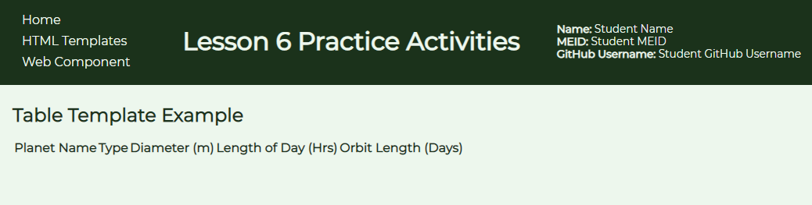
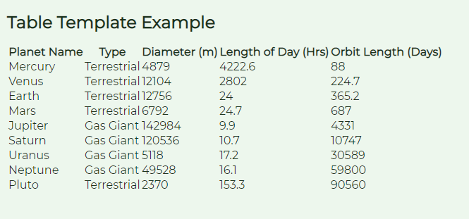
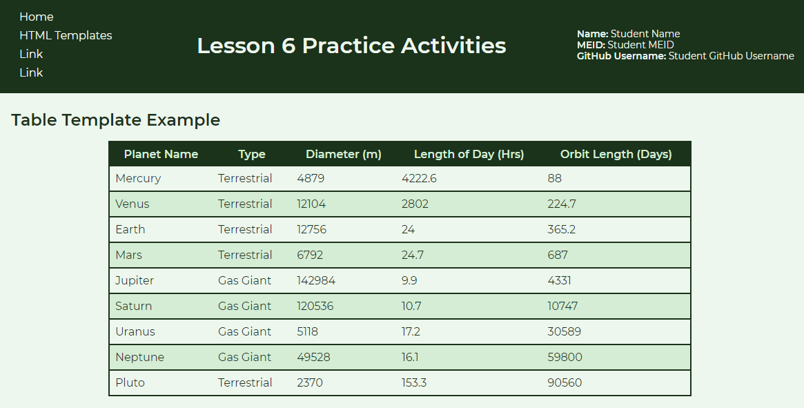

# Populate Table Activity
In this activity, you will utilize an HTML template element to help populate a table. This can be useful in scenarios where you may not know the exact number of elements you need and are loading data from an external source. In this instance, the data will be from a JSON file that will act as a basic database. The script will run through the data within the JSON file and create new rows for each object and populate the row cells with the individual property values.

> TIP: If you are seeing the hashtag marks before the headings, you are viewing this file in edit mode. Right click on the file within the Explorer pane and select the `Open Preview` option to view a read only mode that has styling applied to it.

## Activity Objectives
1. Create the basic structure of the table.
2. Create the template element to be used to add the data to the table.
3. Link to the external JavaScript file.
4. Style the elements with CSS.

## Review Data Files
Before you begin creating the template, you are encouraged to review the `JS` and `JSON` files within the `scripts` folder to become familiar with the code. 

The `JSON` file is a data file that stores the information that will be placed within the table dynamically. This file is a basic way of working with external data to help mimic how you may pull in data into a web page and add it. While the methods may be different, the overall concepts would be similar with other types of data sources, like databases. In looking over the file, you will see that there are properties, which represent the table cells within a single table row, that are grouped together with each group representing a new table row to be added to the page. After setting up the HTML page and HTML template element, you can modify the `JSON` file to add new groups to add new rows to the table with no limit on the number of rows you can add, theoretically since there will always be hardware limitations of how much a computer can process without freezing up a user's device. If you add new columns to the table to display other properties, then you just need to adjust the `template` element to account for those new columns and the script to make sure that the properties are added to the new columns following the existing pattern.

The `JS` file contains the JavaScript code that will first find the `JSON` file so it has data to work with. Then it will find the `template` element within the HTML file and clone the elements within it, insert the data from the `JSON` file into the appropriate cloned elements, and then add it to the `tbody` element of the table. There are comments throughout the code that explains what the code is for to help you read and understand the code a bit more, if you are new to JavaScript.

## HTML Directions
1. Open the `index.html` file within the root of the repo.
2. Update the content in the `div` element within the header with your information.
3. Save and apply a commit to the file.

### Create HTML Template Page
1. If necessary, open the `index.html` file.
2. Use the *Save As* command and save the file into the `html-templates` folder with the name `table-template.html`.
3. Remove the `dl` element and children from the `main` element.
4. Change the second level heading text to read: `Table Template Example`
5. Create a table element with the following:
   1. A `thead` with a table row of 5 `th` elements with the following text in each column, respectively:
      1. Planet Name
      2. Type
      3. Diameter (m)
      4. Length of Day (hrs)
      5. Orbit Length (days)
   2. A `tbody` element. *You will not create any children as that will be done using the template and JavaScript.*
6. Save and apply a commit to the file.
7. After the `main` element and before the end tag for the `body`, create a new `template` element with an `id` of `planetrow`.
8. Within the template element:
   1. Create a table row element.
   2. Create 5 table data elements within the row.
9. Save and apply a commit to the file.

Take this opportunity to load the web page in a browser to see what it looks like. Your table should not have any data in it other than the table head row at this point because we have not linked to the JavaScript file, like in the example image below.

> TIP - You should have a Preview extension installed if you installed the extension pack from the course introduction lesson. To view the page in a virtual web server, with the HTML file open and the tab selected, click on the `View` menu and select the `Command Palette` option. Then type in "preview" and select the option to preview the page in an external browser (or you can open the preview to the side if you wish to view the page within VS Code directly). The page should load within your browser. This is a good method for testing what your page looks like and making sure your links work correctly as it will reload automatically as you make changes to your HTML and CSS documents. 

1. Use a `script` element to link to the `clone-template.js` file within the `scripts` folder.
2. Save and apply a commit to the file.

After linking to the script, if you reload the web page in your browser you should now see the data appear within the table.

## Styling Directions
Use any appropriate selectors and property-value pairs to style the web pages and elements. Keep in mind the cascade, specificity, and inheritance as you apply properties to the various elements.

1. Open the `main.css` file from the `css` folder.
2. Fill in your details within the comment at the top of the file.
3. Style the table as follows:
   1. Add a `2px` solid border using the `main-color-800` color variable.
   2. Collapse the borders.
   3. Set the width to be `75%`.
   4. Set the margins to `auto` to center it on the page.
4. Style the `th` and `td` elements as follows:
   1. Add a padding of `.5rem`.
   2. Change the background color of the `th` element to the `main-color-800` color variable and the text color to the `main-color-300` color variable.
5. Style every alternate row of the table as follows: *HINT: use the nth-of-type() pseudo-class selector.*
   1. Apply the `main-color-300` color variable to the background.
   2. Apply the same border as the `table` element to the top and bottom borders of the row.
6. Save and apply a commit to the file.

After adding the table styles, the page should look like the following.

## Conclusion
When you are done with the activity:
1. Be sure you check for any validation, spelling, and grammar errors and correct them.
2. Sync the files (i.e., push your changes) with the remote repo on GitHub.
