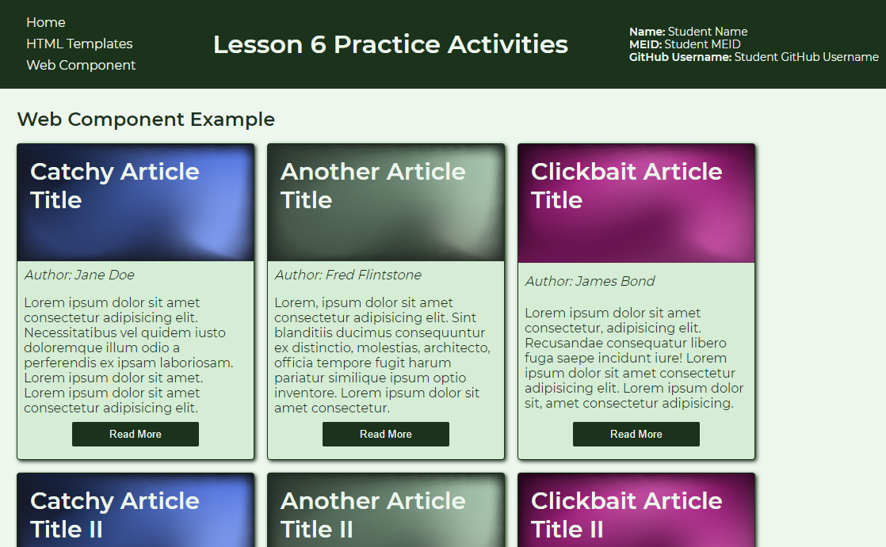

# Basic Web Component Activity
In this activity, you will create a custom web component that can be used to on a blog web site to highlight blog articles on the home page, or at the end of an article to highlight related articles.

> TIP: If you are seeing the hashtag marks before the headings, you are viewing this file in edit mode. Right click on the file within the Explorer pane and select the `Open Preview` option to view a read only mode that has styling applied to it.

## Activity Objectives
1. Create the basic structure of the template.
2. Create the custom element to be used with slot data.
3. Link to the external JavaScript file.
4. Style the elements with CSS.

## Review Data Files
Before you begin creating the web component, you are encouraged to review the `JS` within the `scripts` folder to become familiar with the code. 

The `JS` file contains the JavaScript code that will tell the browser how to work with the custom element. There is also code in there to retrieve the attribute value applied to the custom element so it can apply it to the card heading as a background image. There are comments throughout the code that explains what the code is for to help you read and understand the code a bit more, if you are new to JavaScript.

## HTML Directions
1. Open the `index.html` file.
2. Use the *Save As* command and save the file into the `html-templates` folder with the name `web-component.html`.
3. Remove the `dl` element and children from the `main` element.
4. Change the second level heading text to read: `Web Component Example`
5. Create a `div` element with a class of `article-grid`.
6. Create within the `div` element the following:
   1. A custom element with the name of `article-card`. *Remember to create a start and end tag for the element.*
   2. Add an `img` attribute to the element with a value that is the relative URL to the `placeholder-blue.png` file. *This is used to add the image as a background image to the card via the script.*
   3. Create a `span` element with a `slot` attribute and value of `title`. Add your own article title as the text of the element.
   4. Create a `span` element with a `slot` attribute and value of `author`. Add a name of your own choosing as the text of the element.
   5. Create a `span` element with a `slot` attribute and value of `snippet`. Add 1-2 sentences worth of lorem ipsum text as the text of the element.
7. Save and apply a commit to the file.
8. Create 4-6 additional copies of the custom element changing the relative URL for the `img` attribute to use the other placeholder images, modifying the titles, authors, and snippets to make them somewhat unique. *You will need to reuse the placeholder images since only 3 are provided.*
9. Save and apply a commit to the file.
10. After the `main` element and before the end tag for the `body`, create a new `template` element with an `id` of `article-card-template`.
11. Within the template element:
   1. Create a `link` element that points to the `main.css` file. *This is needed to style the cards.*
   2. Create a `div` element with a class of `article-card`.
   3. Within the `div` element:
      1. Create a level 3 heading with a class of `article-title`. Create a `slot` element with a `name` attribute of `title`.
      2. Create a paragraph with a class of `article-author`. Add the text `Author: ` and then a `slot` element with a `name` of `author`.
      3. Create a paragraph with a class of `article-snippet`. Add a `slot` element with a `name` of `snippet`.
      4. Create a button with a class of `read-more` and the text `Read More`.
      > HINT: The names used in the `slot` elements should match the `slot` attribute values used within the custom element.
12. Save and apply a commit to the file.
13. Use a `script` element to link to the `create-component.js` file within the `scripts` folder.
14. Save and apply a commit to the file.

## Styling Directions
Use any appropriate selectors and property-value pairs to style the web pages and elements. Keep in mind the cascade, specificity, and inheritance as you apply properties to the various elements.

1. Open the `main.css` file from the `css` folder.
2. Add the styles for the article cards after the comment that tells you where to place your styles.
3. Style the `article-grid` element as follows:
   1. Convert it to a flex container.
   2. Set the flex direction to `row`.
   3. Allow the flex items to `wrap`.
   4. Add a gap of `1rem`.
4. Style the `article-card` class as follows:
   1. Add a thin solid border using the `main-color-800` variable.
   2. Add a border radius of `.25rem`.
   3. Add a width of `300px` and a height of `400px`.
   4. Convert the element to a flex container with a column flex direction and no wrapping.
   5. Justify the content so there is space between.
   6. Add a bottom padding of `1rem`;
   7. Apply the `main-color-300` variable as the background color.
   8. Add a box shadow.
5. Style the `article-title` class as follows:
   1. Set the font size to `1.85rem`.
   2. Set the color to the `main-color-200` variable.
   3. Add a height of `150px` and a width of `100%`.
   4. Add a padding of `1rem`.
6. Style the `article-author` class as follows:
   1. Add a margin of `.5rem`.
   2. Apply an italic font style.
7. Style the `article-snippet` class as follows:
   1. Add a margin of `.5rem`.
8. Style the `read-more` class as follows:
   1. Add a width of `10rem`.
   2. Self align the item to the `center`.
   3. Apply the `main-color-800` variable as the background color.
   4. Apply the `main-color-200` variable as the text color.
   5. Set the border to `none`.
   6. Add a padding of `.5rem`.
   7. Create a hover state and set the background color to the `accent-color-500` variable.
   8. Create a focus state and set the outline to be `3px` dashed and uses the `accent-color-500` variable for the color.
9. Save and apply a commit to the file.

When you are done, your page should look similar to the following image:

## Conclusion
When you are done with the activity:
1. Be sure you check for any validation, spelling, and grammar errors and correct them.
2. Sync the files (i.e., push your changes) with the remote repo on GitHub.