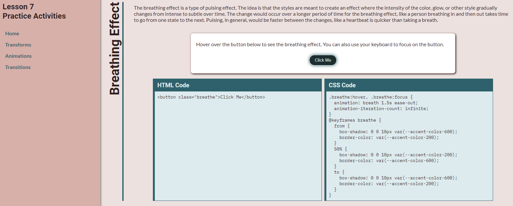

# Breathe Effect Activity
In this activity, you will create an animation that will be used to create a breathing effect on a link state for a button.

## Activity Objectives
1. Create a button to demo the styles.
2. Create keyframe animations.
3. Apply the animation to an element.
4. Apply additional styles to elements.

## HTML Directions
1. Create a copy of the `transitions.html` file and save it with the name of `animations.html` into the root of the repo (i.e., where the index.html file is located).
2. Modify the text of the second level heading to read `Menu Slide Animation`
3. Remove the content from the `code` elements within the `html-code` and `css-code` elements.
4. Change the paragraph to read: `The breathing effect is a type of pulsing effect. The idea is that the styles are meant to create an effect where the intensity of the color, glow, or other style gradually changes from intense to subtle over time. The change would occur over a longer period of time for the breathing effect, like a person breathing in and then out takes time to go from one state to the next. Pulsing, in general, would be faster between the changes, like a heartbeat is quicker than taking a breath.`
5. Save and apply a commit to the file.
6. In the `demo` element:
   1. Add a paragraph with the following instructions: `Hover over the button below to see the breathing effect. You can also use your keyboard to focus on the button.`
   2. Create a button element with a class of `breathe` and the display text of `Click Me`.
7. Copy the button code and paste it into the `code` element of the `html-code` element. *Be sure to escape the characters.*

## Styling the Transformations
Use any appropriate selectors and property-value pairs to style the web pages and elements. Keep in mind the cascade, specificity, and inheritance as you apply properties to the various elements.

Add the styles after the `Animation Styles below this comment`.

1. Create a animation with the following:
   1. An identifier of `breathe`.
   2. For the `from` keyframe:
      1. Create a box shadow that moves `0` units in the horizontal and vertical directions, a `10px` blur radius, and uses the `--accent-color-600` variable for the color.
      2. Set the border color to use the `--accent-color-200` variable.
   3. For the `50%` keyframe:
      1. Create a box shadow that moves `0` units in the horizontal and vertical directions, a `10px` blur radius, and uses the `--accent-color-200` variable for the color.
      2. Set the border color to use the `--accent-color-600` variable.
   4. For the `to` keyframe:
      1. Create a box shadow that moves `0` units in the horizontal and vertical directions, a `10px` blur radius, and uses the `--accent-color-600` variable for the color.
      2. Set the border color to use the `--accent-color-200` variable.
   > You have to have 3 keyframes in the animation to get the effect to look right of going in and out. If you only had the `from` and `to` keyframes then it will give a partial breathing effect and a partial pulse effect, which is undesirable in this instance.  
2. Style the `breathe` element that is a descendant of the `demo` element as follows:
   1. Set the top and bottom margins to `.5rem` and the left and right margins to `auto`.
   2. Add a top and bottom padding of `.5rem` and a left and right padding of `1rem`.
   3. Change the display to `block`. *This will make sure that the margins are applied as desired.*
   4. Add a solid border with a width of `1px` and using the `--accent-color-400` for the border color.
   5. Use the `--accent-color-200` variable for the background color.
   6. Set the text color to use the `--accent-color-800` variable.
   7. Add a border radius to all corners of `1rem`. *This will create a pill shaped button.*
3. Style the `hover` state for the `breathe` element that is a descendant of the `demo` element, and the `focus` state for the `breathe` element that is a descendant of the `demo` element as follows:
   1. Set the background color to use the `--accent-color-800` variable.
   2. Set the text color to use the `--accent-color-200` variable.
   3. Define animation name as `breathe`.
   4. Define the animation duration as `1500ms`.
   5. Define the animation timing function to be `ease-out`.
   6. Define the animation iteration count to be `infinite` to make it keep repeating as long as the button is being hovered over or receiving focus.
4. Save and apply a commit to the file.

Preview your web page in a browser to look at what the button look like when you hover or focus on the it. To focus, use the `Tab` key on your keyboard to move to the next item and `Shift` + `Tab` to move to the previous item.

## Add code example to HTML
1. Copy the selector and declaration block that contain the animation properties and paste it into the `code` element within the `css-code` element.

The following image is an example of what the page should look like after adding the styling and content to the page.

## Conclusion
When you are done with the activity:
1. Be sure you check for any validation, spelling, and grammar errors and correct them.
2. Sync the files (i.e., push your changes) with the remote repo on GitHub.