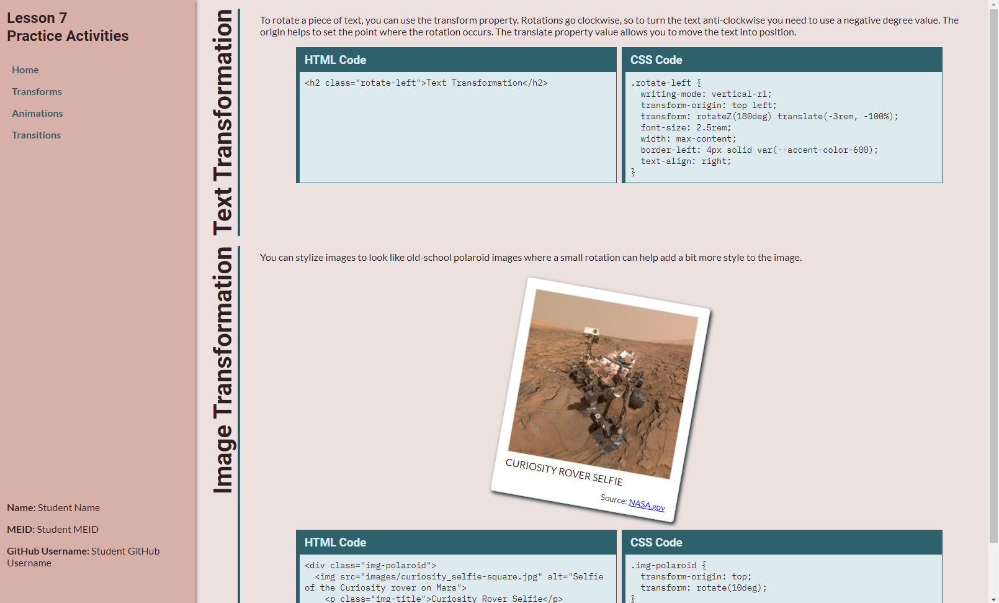

# Text and Image Transformation Activity
In this activity, you will apply transformations to headings and to an image to help the image stand out a bit on the page.

## Activity Objectives
1. Add content to transform.
2. Apply transformation styles.
3. Apply additional styles to elements.

## HTML Directions
1. Open the `index.html` file within the root of the repo.
2. Add the author, keywords, and description metadata in the `head` element.
3. Update the information within the `student-info` element.
4. Save and apply a commit to the file.

### Create Transform Page
1. Create a copy of the `index.html` file and save it with the name of `transforms.html` into the root of the repo (i.e., where the index.html file is located).
2. Delete all child elements of the of `main` element, leaving the `main` element.
3. Create a section with a class of `example` within the `main` element.
4. Within the `example` section:
   1. Create a second level heading with a class of `rotate-left` with the following text: `Text Transformation`
   2. Create a `div` element with a class of `content`.
5. Within the `content` div element:
   1. Create a paragraph with the following text: `To rotate a piece of text, you can use the transform property. Rotations go clockwise, so to turn the text anti-clockwise you need to use a negative degree value. The origin helps to set the point where the rotation occurs. The translate property value allows you to move the text into position.`
   2. Create a `div` element with a class of `example-code`.
6. Within the `example-code` div element:
   1. Create a `div` element with a class of `html-code`.
   2. Create another `div` element with a class of `css-code`.
   3. Within each `div` add a third level heading with the text `HTML Code` and `CSS Code`, respectively.
   4. After each heading, create a `pre` element.
   5. Within the `pre` element, create a `code` element.
      1. Once you are done with the CSS, you will paste in the CSS code you used within the `code` element.
      2. NOTE: If you indent your code to help improve readability, you may notice that the code appears far to the right when you preview the page in the browser. This is due to the indents or spaces before each line. If you remove the indents/spaces before each line, the code will move to the left when you preview it.
7. Save and apply a commit to the file.
8. Copy the section and its children and paste a copy of it after the closing section tag.
9. In the new section:
    1. Change the heading text to read: `Image Transformation`
    2. Change the paragraph text to read: `You can stylize images to look like old-school polaroid images where a small rotation can help add a bit more style to the image.`
    3. Within the `content` div element:
       1. Create a new `div` element with a class of `img-polaroid` after the paragraph.
    4. Within the `img-polaroid` element:
       1. Add an image element using the Curiosity selfie image with appropriate `alt` text.
       2. Create a paragraph with a class of `img-title` and the following text: `Curiosity Rover Selfie`
       3. Create another paragraph with a class of `img-attribution` and the following text: `Source: NASA.gov`
       4. Create a link using the `NASA.gov` text to point to the following URL: `https://www.nasa.gov/sites/default/files/thumbnails/image/curiosity_selfie.jpg`
10. Save and apply a commit to the file.

## Styling the Transformations
Use any appropriate selectors and property-value pairs to style the web pages and elements. Keep in mind the cascade, specificity, and inheritance as you apply properties to the various elements.

Add the styles after the `Transform Styles below this comment`.

1. Style the `example` section element as follows:
   1. Convert it to a grid container.
   2. Define the template columns to use `4rem` and `1fr`.
   3. Add a gap of `1rem`.
2. Style the `rotate-left` element as follows:
   1. Add the element to the 1st grid column.
   2. Set the font size to `2.5rem`.
   3. Add a width of `max-content`.
   4. Align the text to the `right`. *This will make sure that the last letter in the heading will appear along the top of the parent element.*
   5. Set the `writing-mode` to `vertical-rl`. *This will change the direction the text is written in.*
   6. Set the transform origin to `top left`.
   7. Apply the following transformations:
      1. Rotate in the Z axis `180deg`.
      2. Translate `-3rem` in the X axis, and `-100%` in the Y axis. *Since the origin is in the top left corner, it will rotate to be off screen. The values are based upon the original height and width of the element.*
   8. Add a solid left border of `4px` with the `--accent-color-600` variable. *When you preview the HTML page in a browser, notice the edge that border is applied to. It actually is on the right side, but we need to apply it to the left because we rotated the element 180 degrees making the left border now on the right side.*
3. Style the `content` div element as follows:
   1. Add the element to the 2nd grid column.
4. Style the `example-code` div element as follows:
   1. Convert the element to a flex container.
   2. Set the flex direction to be `row`.
   3. Add a gap of `.5rem`.
   4. Apply a width of `90%`.
   5. Center the element within the given area by setting the margins to `auto`.
5. Style the `html-code` and `css-code` div elements as follows:
   1. Apply a solid border of `1px` using the `--accent-color-600` variable to the top, right, and bottom borders.
   2. Apply a solid left border of `6px` using the same accent color.
   3. Add a background color using the `--accent-color-200` variable.
   4. Set the width to `50%`.
6. Style the third level heading in the `example-code` element as follows:
   1. Apply the `--accent-color-600` variable to the background color.
   2. Set the text color to `--accent-color-200`.
   3. Add padding of `.5rem` to all sides.
7. Style the `pre` element within the `example-code` element as follows:
   1. Apply a margin of `.5rem` to all sides.
   2. Change the font size to be `.85rem`.
   3. Set the `white-space` property to `pre-wrap`. *This is used to line wrap within the given dimensions of its parent element. Otherwise long lines of code would extend outside the parent element's boundaries.*
   4. Use the `word-break` property to `break-all` words. *This is used to break really long bits of text, like the URL, to ensure that the line wrap functionality works properly.* 
8. Save and apply a commit to the file.
9. Style the `img-polariod` div element as follows:
   1. Add a width of `300px`.
   2. Add a height of `350px`.
   3. Add a padding of `1rem`.
   4. Set the background color to `white`.
   5. Add a solid, lightgray border with a width of `1px`.
   6. Add a `5px` border radius.
   7. Create a `2rem` margin.
   8. Float the element to the `right`.
   9. Add a box shadow that extends `3px` in the left and bottom directions with a `6px` blurring effect using the `--accent-color-800` variable.
   10. Set the transform origin to be on the `top`.
   11. Apply a rotation transformation of `10deg`.
10. Style the image element within the `img-polaroid` div element as follows:
   12. Set the width to be `100%`.
   13. Set the height to be `auto`.
   14. Add a solid, lightgray border with a width of `1px`.
11. Style the `img-title` element as follows:
   15. Apply a `text-transform` of `uppercase`.
   16. Add a top and bottom padding of `.25rem` and no left and right padding.
12. Style the `img-attribution` element as follows:
   17. Set the font-size to be `smaller`.
   18. Align the text to the `right`.
13. Save and apply a commit to the file.

## Add code example to HTML
1. For the first section:
   1. Copy the second level heading code and paste it into the `code` element within the `html-code` element.
      1. Be sure that you escape the code after pasting it so it does not get interpreted as actual HTML code. I.e., change the `<` character to `&lt;`.
      2. The [Escape HTML Code](https://marketplace.visualstudio.com/items?itemName=raymondcamden.htmlescape-vscode-extension) extension can help with this process. You can select the code, show the escaped version and then copy and paste the escaped code in instead. If you don't install the extension, you will have to do the process manually.
   2. Copy the selector and declaration block for the `rotate-left` element and paste it into the `code` element within the `css-code` element.
2. For the second section:
   1. Copy the `img-polarioid` element, and its children, and paste it into the `html-code` element. Be sure to escape the characters.
   2. Copy the selector and declaration block for the `img-polaroid` element and paste it into the `css-code` element within the `css-code` element.

The following image is an example of what the page should look like after adding the styling and content to the page.

## Conclusion
When you are done with the activity:
1. Be sure you check for any validation, spelling, and grammar errors and correct them.
2. Sync the files (i.e., push your changes) with the remote repo on GitHub.