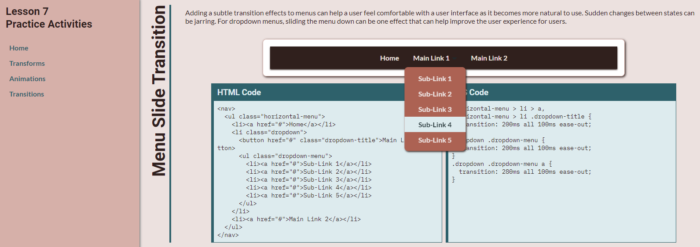

# Dropdown Menu Transition Activity
In this activity, you will apply transitions to create a dropdown menu that will transition between link states and create a slide in effect.

## Activity Objectives
1. Add a demo navigation menu.
2. Style the navigation menu with link states.
3. Apply transition styles to the menu items.
4. Apply additional styles to elements.

## HTML Directions
1. Create a copy of the `transforms.html` file and save it with the name of `transitions.html` into the root of the repo (i.e., where the index.html file is located).
2. Delete the second section and its children.
3. Change the second level heading to `Menu Slide Transition`.
4. Change the paragraph to read as follows: `Adding a subtle transition effects to menus can help a user feel comfortable with a user interface as it becomes more natural to use. Sudden changes between states can be jarring. For dropdown menus, sliding the menu down can be one effect that can help improve the user experience for users.`
5. After the paragraph, create a `div` element with a class of `demo`.
6. Within the `demo` element:
   1. Create a navigation element.
   2. Within the navigation element:
      1. Create an unordered list with a class of `horizontal-menu`.
      2. Add three list items to the ordered list.
      3. In the first list item, add a dummy link pointing to `#` for the `href` attribute and the link text of `Home`.
      4. In the second list item,
         1. Add a class of `dropdown` to the list item.
         2. Add a button with a class of `dropdown-title` and display text of `Main Link 1`.
         3. Add a nested unordered list with:
            1. A class of `dropdown-menu`
            2. 5 list items with dummy links in each list item with the the display text of `Sub-link #`, where the `#` is a number between 1 to 5, respectively.
      5. In the third list item, add a dummy link pointing to `#` for the `href` attribute and the link text of `Main Link 2`.
7. Remove the content from the `code` elements in the `html-code` and `css-code` elements.
8. Copy the navigation element, and its children, and paste it into the `code` element for the `html-code` element. *Be sure to escape the characters.*
9. Save and apply a commit to the file.

## Styling the Transformations
Use any appropriate selectors and property-value pairs to style the web pages and elements. Keep in mind the cascade, specificity, and inheritance as you apply properties to the various elements.

> In this activity, you will need to utilize selectors to target specific element. This means you will need to use multiple selectors (e.g., `a, button`), descendant selectors (e.g., `.demo nav`), combinator selectors (e.g., `.horizontal-menu > li`), pseudo-class selectors (e.g., `:hover, :focus-within`), pseudo-element selectors (e.g., `::after`), etc. Refer back to Lesson 2 if you need a refresher on the types of selectors you can use.

> Pay attention to the specificity of the selectors to ensure the properties are applied correctly. If you hover over a selector, VS Code will show you the specificity, which you can use to compare the selector and know if you need to increase the specificity.

Add the styles after the `Transition Styles below this comment`.

1. Style the `demo` section element as follows:
   1. Add a white background color.
   2. Apply a solid border of `1px` to all sides using the `--main-color-800` variable.
   3. Apply a `.5rem` border radius to all corners.
   4. Apply a width of `70%`.
   5. Set the top and bottom margins to `1rem` and the left and right margins to `auto`.
   6. Add a `1rem` padding to all sides.
   7. Add a box shadow.
2. Style the navigation element within the `demo` element as follows:
   > Use an appropriate selector to target the desired element so you do not style the navigation element that already exists on the page.
   1. Use the `--main-color-800` variable for the background color.
   2. Convert the element to a grid container.
   3. Use the `place-items` property to place the grid items in the `center` of the container.
   4. Add a left and right padding of `1rem` and no top and bottom padding.
   5. Add a box shadow. 
3. Style the `horizontal-menu` element as follows:
   1. Remove the list style type, so the bullet markers do not appear.
   2. Convert the element to a grid container.
   3. Set the grid auto flow to `column`. *If you are previewing your page as you work, you will notice that this makes the nested list appear underneath the parent list item.*
   4. Align the grid items to the `center`.
   5. Apply a position of `relative`.
4. Save and apply a commit to the file.
5. Add a left and right margin of `.5rem`, and no top and bottom margin, to the list items that are children of the `horizontal-menu` element. Hint: Use `>` to denote child relationships.
6. Style the link elements that are descendants of the list items that are children of the `horizontal-menu` element, and the `dropdown-title` button as follows:
   > This will style all links in the parent and nested list, and the button.
   1. Apply a text color using the `--main-color-100`.
   2. Remove the text decoration.
   3. Align the text to the `center`.
   4. Change the display to `inline-block`.
   5. Apply a bold font weight.
   6. Add a `1rem` padding to all sides.
7. Set the outline to `none` for the `focus` state for the link elements that are descendants of the list items that are children of the `horizontal-menu` element, and the `focus` state for the `dropdown-title` element that is a descendant of the list items that are children of the `horizontal-menu` element.
8. Style the link elements that are children of the list items that are children of the `horizontal-menu` element, and the `dropdown-title` element that is a descendant of the list items that are children of the `horizontal-menu` element. HINT: `parent > child > child, parent > child descendant`
   > This is designed to style only the links in the parent list, and the button.
   1. Add a top and bottom padding of `1rem` and a left and right padding of `.5rem`.
   2. Add a transition duration of `200ms`.
   3. Add a transition property of `all`.
   4. Add a transition delay of `100ms`.
   5. Add a transition timing function of `ease-out`.
9. Style the following states for the indicated elements: 
   1. Target the `hover` state for the link elements that are children of the list items that are children of the `horizontal-menu` element.
   2. Target the `focus` state for the link elements that are children of the list items that are children of the `horizontal-menu` element.
   3. Target the `hover` state for the `dropdown-title` element that is a descendant of the list items that are children of the `horizontal-menu` element. 
   4. Target the `focus` state for the `dropdown-title` element that is a child of the list items that are children of the `horizontal-menu` element.
   5. Use the `--accent-color-200` variable for the background color.
   6. Use the `--accent-color-800` variable for the text color.
10. Save and apply a commit to the file.

### Style the Dropdown Menu
1. Apply a `relative` position to the `dropdown` element.
2. Style the `dropdown-title` element that is a descendant of the `dropdown` list item as follows:
   > The first three steps will remove the default styles that a browser applies to buttons to help it look like the links within the navigation menu.
   1. Set the background color to `transparent`.
   2. Set the border to `none`.
   3. Set the font family and font size to `inherit` their values from its parent.
   4. Convert the element to an `inline-flex` container.
   5. Align the flex items to the `center`.
3. Create an `after` pseudo-element for the `dropdown-title` element that is a descendant of the `dropdown` list item and apply the following styles:
   > This will create an arrow pointing down next to the button to graphically indicate there is a dropdown menu.
   1. Set the `content` to be empty with double quotes `""`.
   2. Add a solid transparent border of `.35rem` width.
   3. Add a top border color using the `--main-color-200` variable.
   4. Set the opacity to `.7`.
   5. Set the left margin to `.35rem`.
   6. Translate in the Y axis a value of `.3rem`.
4. Style the following states for the indicated elements: 
   1. Target the `after` pseudo-element for the `dropdown-title` element when the `dropdown` element is in the `hover` state. Hint: `element:hover element:after`
   2. Target the `after` pseudo-element for the `dropdown-title` element when the `dropdown` element is in the `focus-within` state. *The `focus-within` state is used to make the dropdown menu appear and accessible for keyboard users when they land on the dropdown element.*
   3. Use the `--accent-color-800` variable for the top border color.
5. Save and apply a commit to the file.
6. Style the `dropdown-menu` element that is a descendant of the `dropdown` element as follows:
   1. Set the position to be `absolute`.
   2. Calculate the `top` property by taking `.25rem` from `100%`.
   3. Set the `left` property to `50%`.
   4. Set the minimum width to be 15 character units (`ch`).
   5. Use the `--main-color-400` as the background color.
   6. Apply a box shadow.
   7. Add a top and bottom padding of `.5rem` and no left and right padding.
   8. Set the transform origin to `top center`.
   9. Transform the element by rotating in the X axis by `-90deg` and translating in the X axis `-50%`. *This rotation helps to hide the dropdown menu as the height is effectively removed. If you could see things in three dimensions and at a different angle, the bottom of the menu would be going deeper into the screen away from you.*
   10. Set the opacity to `.3`.
   11. Set the visibility to `hidden`. *This will help with accessibility by hiding the menu from screenreaders until it is activated.*
   12. Add a border radius of `.5rem`.
   13. Add a transition duration of `200ms`.
   14. Add a transition property of `all`.
   15. Add a transition delay of `100ms`.
   16. Add a transition timing function of `ease-out`.
7. Style the links that are descendants of the `dropdown-menu` element that is a descendant of the `dropdown` element as follows:
   1. Set the display to be `block`.
   2. Add a padding of `.5rem` to all sides.
   3. Add an opacity of `0`.
   4. Add a transition duration of `200ms`.
   3. Add a transition property of `all`.
   4. Add a transition delay of `100ms`.
   5. Add a transition timing function of `ease-out`.
8. Style the `hover` state for the link elements that are descendants of the `dropdown-menu` element that is a descendant of the `dropdown` element, and the `focus` state for the link elements that are descendants of the `dropdown-menu` element that is a descendant of the `dropdown` element as follows:
   1. Use the `--accent-color-200` for the background color.
   2. Use the `--accent-color-800` for the text color.
   3. Set the outline to `none`.
9. Save and apply a commit to the file.
CONT
10. Style the `dropdown-menu` when the `dropdown` element is in a `hover` state, and when it is in the `focus-within` state as follows:
    1.  Set the opacity to `1`.
    2.  Set the visibility to `visible`.
    3.  Transform the element by rotating in the X axis to `0` and translating in the X axis by `-50%`. *The rotation will make the menu appear and due to the length of the transition will appear to slide down into position.*
11. Style the link elements that are descendants of the `dropdown-menu` element when the `dropdown` element is in a `hover` state, and when the `dropdown` element is within the `focus-within` state, as follows:
    1.  Set the opacity to `1`.
12. Save and apply a commit to the file.

Preview your web page in a browser to look at the current state of the navigation menu and what the links look like when you hover or focus on the links. To focus on a menu item, use the `Tab` key on your keyboard to move to the next item and `Shift` + `Tab` to move to the previous item.

## Add CSS code example to HTML
1. Copy the selectors and declaration blocks that contain transition properties and paste them into the `code` element within the `css-code` element.
   1. There should be 3 different declaration blocks. You can remove all other styles not related to the transition properties.
   2. *Be sure to escape the characters for the combinator selectors.*

The following image is an example of what the page should look like after adding the styling and content to the page.

## Conclusion
When you are done with the activity:
1. Be sure you check for any validation, spelling, and grammar errors and correct them.
2. Sync the files (i.e., push your changes) with the remote repo on GitHub.