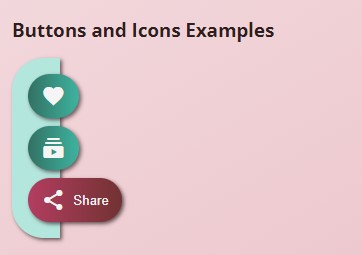

# Gradients and Icons Activity
In this activity, you will utilize icons from Google Material to create buttons and apply gradients to the background and buttons.

## Activity Objectives
1. Create figure elements with captions.
2. Use the picture element to load different quality images based upon viewport width.
3. Style the pre and code elements to look like code.
4. Apply additional styles to elements.

> NOTE: This activity will utilize the icons that are available to use on the Google Fonts web site. More detailed information on how to use the icons can be found at the [Material Icons Guide](https://developers.google.com/fonts/docs/material_icons). You can find more icons to use at [Google Icons](https://fonts.google.com/icons).

## HTML Directions
1. Create a copy of the `graphical-elements.html` file and save it with the name of `gradients.html` into the root of the repo (i.e., where the index.html file is located).
2. Within the head:
   1. Create a link to an external stylesheet.
   2. Use the following URL: `https://fonts.googleapis.com/icon?family=Material+Icons`
3. Within the `main` element:
   1. Delete the second section.
   2. Update the level two heading to `Gradient Examples`.
   3. Delete the figure and its children from the first section; leaving just the level three heading.
4. In the section:
   1. Update the level three heading to read `Buttons and Icons Examples`.
   2. Create a `div` element with a class of `action-menu`.
5. Within the `action-menu` element, create three button elements with a class of `gradient`.
6. Within each button element.
   1. Create two `span` elements.
   2. Add a class to the first span element of `material-icons`.
   3. Add a class to the second span element of `button-title`.
7. For the first button:
   1. Add the text `favorite` in lowercase to the first span element.
   2. Add the text `Like` to the second span element.
8. For the second button:
   1. Add the text `subscriptions` in lowercase to the first span element.
   2. Add the text `Subscribe` to the second span element.
9. For the third button:
   1. Add the text `share` in lowercase to the first span element.
   2. Add the text `Share` to the second span element.
10. Save and apply a commit to the file.

## Styling the Transformations
Use any appropriate selectors and property-value pairs to style the web pages and elements. Keep in mind the cascade, specificity, and inheritance as you apply properties to the various elements.

Add the styles after the `gradient styles` comment.

1. Style the main element as follows:
   1. Apply a linear gradient to the background at a `-30deg` angle and using the `--main-color-200` and `--main-color-100` colors.
2. Style the `action-menu` element as follows:
   1. Apply a background color using the `--accent-color-200` variable.
   2. Apply a `2rem` border radius to the upper left and lower left corners and no radius to the upper and lower right corners.
   3. Apply a width of `3rem`.
   4. Add a `.5rem` padding to all sides.
   5. Add a box shadow.
3. Style the gradient button element as follows:
   1. Apply a border radius of `2em` to all corners.
   2. Apply a margin of `.5rem`.
   3. Apply a top and bottom padding of `.75em` and a left and right padding of `1em`.
   4. Set the border to none.
   5. Apply a box shadow.
   6. Add a linear gradient that moves to the right, using the `--accent-color-500` and `--accent-color-700` colors.
   7. Apply a text color of `whitesmoke`.
   8. Convert the element to a flex container.
   9. Apply a flex direction of row and no wrap.
   10. Align the items to the center.
4. Create a hover state and a focus state for the gradient button and style the two states as follows:
   1. Set the outline to none.
   2. Apply a linear gradient that moves to the left, using the `--main-color-600` and `--main-color-400` colors.
5. Style the button title element as follows:
   1. Set the visibility to hidden.
   2. Set the position to be absolute.
   3. Add a left margin of `.5rem`.
6. Target the button title element when the gradient button is in a hover state and a focus state: HINT: `element:hover element, element:focus element`
   1. Set the visibility to visible.
   2. Set the position to relative.
7. Save and apply a commit to the file.

The following image is an example of what the action menu, buttons, icons, and hover state should look like after adding the styling and content to the page. Hover over each button to see the link states.

## Conclusion
When you are done with the activity:
1. Be sure you check for any validation, spelling, and grammar errors and correct them.
2. Sync the files (i.e., push your changes) with the remote repo on GitHub.
3. Publish your repo using GitHub Pages.