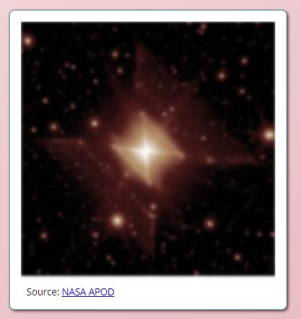
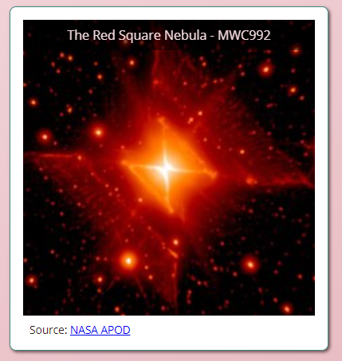

# Graphical Elements Activity
In this activity, you will utilize filters to create different effects on an image and change the effects during link states.

## Activity Objectives
1. Apply filters to the image to saturate and blur the image.
2. Apply filters and transforms to a hover link state.
3. Apply additional styles to elements.

## HTML Directions
1. Create a copy of the `graphical-elements.html` file and save it with the name of `graphic-effects.html` into the root of the repo (i.e., where the index.html file is located).
2. Within the `main` element:
   1. Delete the second section element and its children.
   2. Update the heading to `Graphic Effects`.
3. Change the level three heading to `Filter Example` as the text.
4. Change the class of the figure element to `filter-image`.
5. Change the figure caption element to read `The Red Square Nebular - MWC992`.
6. Change the `NASA APOD` link to point to `https://apod.nasa.gov/apod/ap210926.html`.
7. Within the picture element:
   1. Delete the second source element.
   2. For the remaining source element, change the URL to point to the `RedSquare_Tuthill.jpg` image for the source set.
   3. Change the image to point to the `RedSquare_Tuthill-250.jpg`.
8. Save and apply a commit to the file.

## Styling the Transformations
Use any appropriate selectors and property-value pairs to style the web pages and elements. Keep in mind the cascade, specificity, and inheritance as you apply properties to the various elements.

Add the styles after the `graphic-effects styles` comment.

### Style the Filter Example
All styles will apply to the `filter-image` figure element or its children, so be sure to utilize appropriate selectors to style only the desired element and not all elements on the page.

1. Style the `filter-image` figure element as follows:
   1. Add a white background color.
   2. Apply a thin solid border to all sides using the `--accent-color-600` variable.
   3. Apply a `.5rem` border radius to all corners.
   4. Apply a width of `25rem`.
   5. Set the margins to `auto`.
   6. Add a `1rem` padding to all sides.
   7. Add a box shadow.
   8. Convert the element to a grid container.
   9. Define the template rows and columns to be `1fr`. 
2. Style the picture element as follows:
   1. Set the grid area to be `1 / 1`.
   2. Set the overflow to hidden.
3. Style the figure caption element as follows:
   1. Set the grid area to be `1 / 1`. *With the figure caption and picture element placed in the same grid area, the caption will overlay the image.*
   2. Add an HSLA background color of `0, 0%, 0%, .5`.
   3. Apply the `--main-color-100` variable as the text color.
   4. Add a padding of `.5rem`.
   5. Add a height of `max-content` to ensure the caption will only take enough space to show the text an not the whole grid area.
   6. Align the text to the center.
   7. Apply a transform and rotate it in the X axis `-90deg`.
   8. Apply a transition duration of `200ms` to `all` transition properties.
   9. Set the transition origin to `top`.
4. Target the figure caption when the figure element is in a hover state. HINT: `element:hover element`
   1. Make the figure caption transform and rotate in the X axis `0deg`.
5. Style the image element as follows:
   1. Set the width to `100%`.
   2. Apply a filter to saturate to a level of 30% and blur the image to `2px`.
6. Style the hover state for the image as follows:
   1. Apply a filter to saturate to a level of 100%.
   2. Apply a transform and scale it by `1.15`.
7. Style the `image-source` element as follows:
   1. Set the font size to `.85em`.
   2. Apply a top margin of `.5rem`.
8. Save and apply a commit to the file.

The following images are examples of what the image will look like before and after hovering over the image.

**Before**

 

**After**

## Conclusion
When you are done with the activity:
1. Be sure you check for any validation, spelling, and grammar errors and correct them.
2. Sync the files (i.e., push your changes) with the remote repo on GitHub.