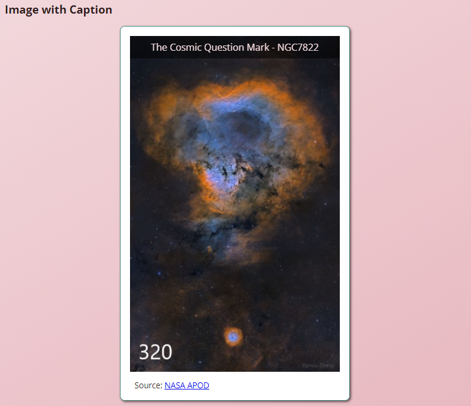
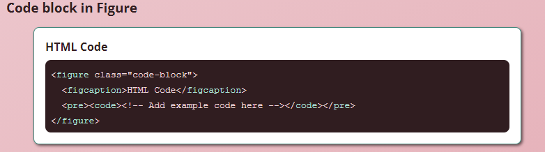

# Graphical Elements Activity
In this activity, you will utilize graphical HTML elements to create an image with a caption that will load an image based upon the width of the viewport and create a code block to display HTML code.

## Activity Objectives
1. Create figure elements with captions.
2. Use the picture element to load different quality images based upon viewport width.
3. Style the pre and code elements to look like code.
4. Apply additional styles to elements.

## HTML Directions
1. Open the `index.html` file. 
2. Update the metadata to appropriate values.
3. Update the information within the footer with your information.
4. Save and apply a commit to the file.

### Create Graphical Element page
1. Create a copy of the `index.html` file and save it with the name of `graphical-elements.html` into the root of the repo (i.e., where the index.html file is located).
2. Within the `main` element:
   1. Delete the paragraph and activity list.
   2. Update the heading to `Graphical Element Examples`.
   3. After the heading, create two `section` elements with a class of `example`.
3. In each section, add a level three heading with `Image with Caption` and `Code block in Figure` as the text, respectively.
4. In the first section, create a figure element with a class of `image-caption`.
5. Within the figure:
   1. Create a picture element.
   2. Create a figure caption element with the text `The Cosmic Question Mark - NGC7822`.
   3. Create a paragraph element with a class of `image-source` and the text `Source: NASA APOD`.
      1. Create a link of the `NASA APOD` text to point to `https://apod.nasa.gov/apod/ap211013.html`.
6. Within the picture element:
   1. Create two source elements and an image element.
   2. For the first source element:
      1. Add a media query (using the `media` attribute) for a minimum width of 900px.
      2. Use the `ngc7822-673.jpg` image as the source set.
      3. Define the type as being an `image/jpg`.
   3. For the second source element:
      1. Add a media query (using the `media` attribute) for a minimum width of 400px.
      2. Use the `ngc7822-320.jpg` image as the source set.
      3. Define the type as being an `image/jpg`.
   4. For the image element:
      1. Use the `ngc7822-124.jpg` image as the source.
      2. Add alt text for the image with the text `NASA astronomy picture of the day`.
7. Save and apply a commit to the file.
8. Within the second section, create a figure element with a class of `code-block`.
9. Within the figure:
   1.  Create a figure caption with the text `HTML Code`.
   2.  Create a `pre` element with a `code` element as a child.
10. Within the code element:
    1. Add a copy of the code you created of the figure element, figure caption, pre, and code tags.
    2. Escape the characters by changing the `<` characters to `&lt;` and `>` to `&gt;`. *You are showing the code that is to be used to create the block within the block itself.*
    3. In between the escaped code elements add an escaped HTML comment with the text `&lt;!-- Add example code here --&gt;`
11. Save and apply a commit to the file.

## Styling the Transformations
Use any appropriate selectors and property-value pairs to style the web pages and elements. Keep in mind the cascade, specificity, and inheritance as you apply properties to the various elements.

Add the styles after the `graphical-element styles` comment.

### Style the Image Caption Figure Element
All styles will apply to the `image-caption` figure element or its children, so be sure to utilize appropriate selectors to style only the desired element and not all elements on the page.
1. Style the `image-caption` figure element as follows:
   1. Add a white background color.
   2. Apply a thin solid border to all sides using the `--accent-color-600` variable.
   3. Apply a `.5rem` border radius to all corners.
   4. Apply a width of `50%`.
   5. Set the margins to `auto`.
   6. Add a `1rem` padding to all sides.
   7. Add a box shadow.
   8. Convert the element to a grid container.
   9. Define the template rows and columns to be `1fr`. 
2. Style the picture element as follows:
   1. Set the grid area to be `1 / 1`.
3. Style the figure caption element as follows:
   1. Set the grid area to be `1 / 1`. *With the figure caption and picture element placed in the same grid area, the caption will overlay the image.*
   2. Add an HSLA background color of `0, 0%, 0%, .5`.
   3. Apply the `--main-color-100` variable as the text color.
   4. Add a padding of `.5rem`.
   5. Add a height of `max-content` to ensure the caption will only take enough space to show the text an not the whole grid area.
   6. Align the text to the center.
   7. Apply a transform and rotate it in the X axis `-90deg`.
   8. Apply a transition duration of `200ms` to `all` transition properties.
   9. Set the transition origin to `top`.
4. Target the figure caption when the figure element is in a hover state. HINT: `element:hover element`
   1. Make the figure caption transform and rotate in the X axis `0deg`.
5. Style the image element to have a width of `100%`.
6. Style the `image-source` element to have a font size of `.85em`.
7. Save and apply a commit to the file.

The following image is an example of what the figure should look like after adding the styling and content to the page. Hover over the element to see the figure caption appear. Resize your browser window to see the image swap out and change based upon the picture element.

### Style th Code Block Element
All styles will apply to the `code-block` figure element or its children, so be sure to utilize appropriate selectors to style only the desired element and not all elements on the page.

1. Style the `code-block` figure element as follows:
   1. Add a white background color.
   2. Apply a thin solid border to all sides using the `--accent-color-600` variable.
   3. Apply a `.5rem` border radius to all corners.
   4. Apply a width of `90%`.
   5. Set the margins to `auto`.
   6. Add a `1rem` padding to all sides.
   7. Add a box shadow.
   8. Convert the element to a grid container.
   9. Define the template rows and columns to be `1fr`. 
2. Style the pre element as follows:
   1. Apply the `--font-code` variable as the font family.
   2. Apply the `--main-color-800` variable as the background color.
   3. Apply the `--main-color-100` variable as the text color.
   4. Apply a padding of `.5rem` to all sides.
   5. Set the overflow to auto.
   6. Set the border-radius to `.5rem`.
3. Style the figure caption as follows:
   1. Apply a bold font weight.
   2. Apply a bottom padding of `.5rem`.
4. Save and apply a commit to the file.

The following image is an example of what the figure should look like after adding the styling and content to the page. Resize your browser window to see the horizontal scroll bars appear when the element is too small for the code. **NOTE**: The HTML tags were wrapped in a `span` element with a class of `html-tag` and a different text color was applied to them to improve some readability. This is an optional activity for you to do.

## Conclusion
When you are done with the activity:
1. Be sure you check for any validation, spelling, and grammar errors and correct them.
2. Sync the files (i.e., push your changes) with the remote repo on GitHub.
3. Publish your repo using GitHub Pages.